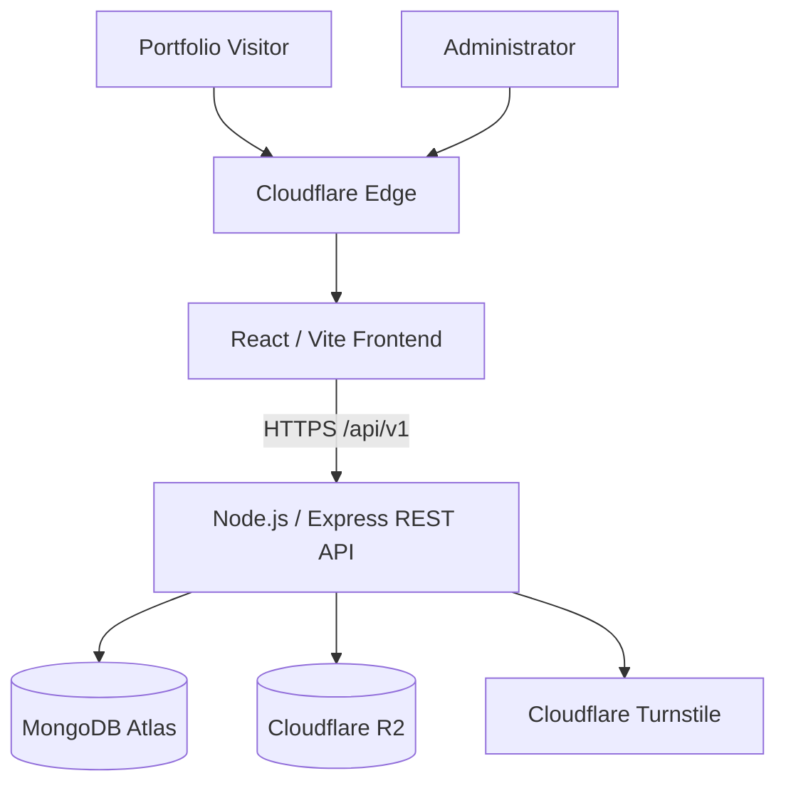

# Samuel Mensah Quaye — Software Developer Portfolio

A production-ready, full-stack software developer portfolio built to showcase software development projects, technical capabilities, project case studies, and professional experience.

The portfolio is designed as a dynamic application rather than a static collection of hardcoded project pages. Projects, media, portfolio settings, enquiries, and other content will be managed through a secure administrative interface.

---

## About the Project

This portfolio positions **Samuel Mensah Quaye** primarily as a:

> **Software Developer | Full-Stack Developer**

The portfolio focuses on software and web development while presenting cybersecurity, cloud, DevOps, IT support, and related technical experience as supporting capabilities.

The system is being designed with production concerns in mind, including:

- Maintainable architecture
- Dynamic project management
- Secure administrator authentication
- REST API design
- Database-backed content
- Cloud media storage
- Security controls
- Testing
- CI/CD
- Cloud deployment
- Technical documentation

---

## Core Objectives

The application is designed to:

- Showcase software development projects professionally
- Present detailed project case studies
- Allow projects to be added without modifying frontend source code
- Provide secure administrative project management
- Manage project screenshots and other media
- Provide a downloadable CV
- Receive portfolio enquiries
- Demonstrate full-stack development capability
- Demonstrate security-conscious engineering
- Support future portfolio expansion

---

## Technology Stack

### Frontend

- React
- Vite
- JavaScript
- Tailwind CSS
- React Router
- ESLint

### Backend

- Node.js
- Express
- REST API
- ES Modules

### Database

- MongoDB Atlas
- Mongoose

### Authentication

Planned authentication architecture includes:

- Argon2id password hashing
- Secure HTTP-only cookies
- Backend authorization
- Login rate limiting
- Controlled administrator provisioning
- No public administrator registration

### Cloud

- Cloudflare Workers with Static Assets
- Cloudflare R2
- Cloudflare Turnstile

### Development & Deployment

- Git
- GitHub
- GitHub Actions — planned
- Node.js 22+

---

## Architecture

The portfolio uses a separated frontend/backend architecture.



The frontend and backend remain independently deployable.

---

## Repository Structure

```text
software-developer-portfolio/
│
├── client/
│   ├── public/
│   ├── src/
│   └── package.json
│
├── server/
│   ├── config/
│   ├── controllers/
│   ├── middlewares/
│   ├── models/
│   ├── routes/
│   ├── services/
│   ├── utils/
│   ├── validators/
│   ├── app.js
│   ├── server.js
│   └── package.json
│
├── docs/
│   ├── requirements.md
│   ├── architecture.md
│   ├── database-design.md
│   ├── api.md
│   ├── security.md
│   ├── threat-model.md
│   ├── local-development.md
│   ├── testing.md
│   ├── cloudflare-deployment.md
│   ├── production-deployment.md
│   └── troubleshooting.md
│
├── .github/
│   └── workflows/
│
├── .editorconfig
├── .gitignore
├── .nvmrc
├── package.json
└── README.md
```

---

## Public Portfolio

The public application is planned to provide:

- Home
- Projects
- Project case studies
- About
- Skills
- Contact
- CV

---

## Dynamic Projects

Projects are database-driven.

The frontend must not require source-code modifications whenever a new portfolio project is added.

Conceptually:

```text
Administrator
      ↓
Admin Dashboard
      ↓
REST API
      ↓
MongoDB Atlas
      ↓
Public Projects API
      ↓
React Portfolio
```

Projects may contain:

- Title
- Slug
- Short description
- Case study
- Problem
- Solution
- Role
- Technologies
- Features
- Challenges
- Outcomes
- Category
- Cover image
- Gallery/media
- Live URL
- Repository URL
- Featured state
- Publication state
- Display order

---

## Project Publication

Projects support publication states such as:

```text
draft
published
```

The backend is responsible for enforcing publication visibility.

Public APIs must not expose draft projects.

---

## Administrator Interface

The administrative application is planned to provide:

- Dashboard overview
- Project management
- Category management
- Media management
- Contact enquiry management
- Portfolio settings
- CV management
- Authentication

There is no public administrator-registration feature.

---

## Media Architecture

Portfolio media is planned to use **Cloudflare R2**.

MongoDB stores media metadata while R2 stores the actual binary objects.

Preferred upload architecture:

```text
Authenticated Admin
        ↓
Express API
        ↓
Temporary upload authorization
        ↓
Browser
        ↓
Cloudflare R2
        ↓
Upload confirmation
        ↓
MongoDB metadata
```

Permanent R2 credentials never belong in frontend code.

---

## Contact Form

The public contact form will use:

- Server-side validation
- Request-size limits
- Rate limiting
- Cloudflare Turnstile
- Safe administrative rendering
- MongoDB enquiry storage

Turnstile validation will occur on the backend.

---

## API

The backend uses a versioned REST API.

Base path:

```text
/api/v1
```

Current foundation endpoint:

```http
GET /api/v1/health
```

Expected response:

```json
{
  "success": true,
  "message": "Portfolio API is running"
}
```

Future API areas include:

```text
/api/v1/projects
/api/v1/categories
/api/v1/contact
/api/v1/auth/*
/api/v1/admin/*
```

See:

```text
docs/api.md
```

for the complete API design.

---

## Security

Security is treated as part of the application architecture rather than a final deployment task.

The security baseline includes or plans:

- Helmet security headers
- Explicit CORS allowlist
- HTTP-only authentication cookies
- Secure production cookies
- Argon2id password hashing
- Authentication and authorization
- No public administrator registration
- Rate limiting
- Login-specific rate limiting
- Contact-specific rate limiting
- Request validation
- Request-size limits
- NoSQL injection protection
- Mass-assignment protection
- XSS protection
- CSRF evaluation/protection
- R2 upload validation
- Cloudflare Turnstile
- Environment secret isolation
- Safe production errors
- Audit logging
- Dependency review
- Security regression testing

See:

```text
docs/security.md
docs/threat-model.md
```

---

## Requirements

The full system requirements are maintained in:

```text
docs/requirements.md
```

This is the primary requirements baseline for the application.

---

## Architecture Documentation

Detailed architecture is maintained in:

```text
docs/architecture.md
```

It documents:

- Frontend architecture
- Backend architecture
- Trust boundaries
- API architecture
- Database architecture
- R2 architecture
- Authentication
- Deployment topology

---

## Database Design

Database architecture is maintained in:

```text
docs/database-design.md
```

Planned primary models:

```text
Admin
Project
Category
MediaAsset
ContactEnquiry
PortfolioSettings
AuditLog
```

---

## Local Development

Detailed local development instructions are available in:

```text
docs/local-development.md
```

### Prerequisites

- Node.js 22+
- npm
- Git
- Modern browser

---

## Clone Repository

```powershell
git clone <repository-url>
cd software-developer-portfolio
```

For development:

```powershell
git checkout develop
```

---

## Install Dependencies

### Frontend

```powershell
cd client
npm install
```

### Backend

```powershell
cd server
npm install
```

---

## Environment Configuration

Environment files must not be committed.

### Frontend

Create:

```text
client/.env
```

from:

```text
client/.env.example
```

Development configuration:

```env
VITE_API_BASE_URL=http://localhost:5000/api/v1
```

---

### Backend

Create:

```text
server/.env
```

from:

```text
server/.env.example
```

Planned configuration:

```env
NODE_ENV=development
PORT=5000

MONGODB_URI=
SESSION_SECRET=

CLIENT_URLS=http://localhost:5173

R2_ACCOUNT_ID=
R2_ACCESS_KEY_ID=
R2_SECRET_ACCESS_KEY=
R2_BUCKET_NAME=

TURNSTILE_SECRET_KEY=
```

Variables for features that have not yet been implemented may remain unset until their implementation phase.

---

## Start Frontend

From:

```text
client/
```

run:

```powershell
npm run dev
```

Vite normally starts at:

```text
http://localhost:5173
```

Use the URL reported by the Vite terminal as authoritative.

---

## Start Backend

From:

```text
server/
```

run:

```powershell
npm run dev
```

Current local backend port:

```text
5000
```

---

## Root Development Commands

The root package configuration provides:

```powershell
npm run client
```

and:

```powershell
npm run server
```

Run them in separate terminals during full-stack development.

---

## Verify Backend

With the backend running:

```powershell
curl.exe -i http://localhost:5000/api/v1/health
```

Expected:

```text
HTTP 200
```

---

## Frontend Lint

From:

```text
client/
```

run:

```powershell
npm run lint
```

---

## Frontend Production Build

Run:

```powershell
npm run build
```

before deployment or after significant frontend changes.

---

## Git Workflow

Primary branches:

```text
main
develop
```

### `main`

Production-ready branch.

### `develop`

Development/integration branch.

Focused feature branches may be created from `develop`.

Example:

```powershell
git checkout develop
git pull
git checkout -b feature/admin-auth
```

---

## Environment Security

Never commit:

```text
.env
MongoDB credentials
R2 credentials
Authentication secrets
Turnstile secret
Deployment tokens
```

Before committing:

```powershell
git status
git diff
```

Verify environment files remain ignored.

---

## Testing

Testing strategy is documented in:

```text
docs/testing.md
```

Testing will include:

- Unit tests
- API integration tests
- Database tests
- Authentication tests
- Authorization tests
- Security regression tests
- Project publication tests
- R2 tests
- Contact/Turnstile tests
- Frontend tests
- End-to-end tests
- Production smoke tests

---

## Cloudflare Deployment

Cloudflare-specific deployment architecture is documented in:

```text
docs/cloudflare-deployment.md
```

The approved frontend target is:

```text
Cloudflare Workers with Static Assets
```

Cloudflare R2 is the approved portfolio media platform.

---

## Production Deployment

The full production topology and deployment procedure are documented in:

```text
docs/production-deployment.md
```

Production architecture:

```text
Cloudflare Frontend
        ↓
Node/Express API
       ↙ ↘
MongoDB   R2
        \
       Turnstile
```

---

## Troubleshooting

Development and deployment troubleshooting is documented in:

```text
docs/troubleshooting.md
```

It covers:

- Node/npm
- React/Vite
- Tailwind
- Express
- Environment variables
- CORS
- Ports
- MongoDB
- Authentication
- Cookies
- R2
- Turnstile
- Cloudflare
- Git
- CI/CD
- Production deployment

---

## Documentation

The project maintains the following technical documentation:

| Document | Purpose |
|---|---|
| `docs/requirements.md` | System requirements |
| `docs/architecture.md` | Application architecture |
| `docs/database-design.md` | MongoDB/Mongoose design |
| `docs/api.md` | REST API specification |
| `docs/security.md` | Security architecture |
| `docs/threat-model.md` | Threat analysis |
| `docs/local-development.md` | Local setup and workflow |
| `docs/testing.md` | Testing strategy |
| `docs/cloudflare-deployment.md` | Cloudflare architecture |
| `docs/production-deployment.md` | Production deployment |
| `docs/troubleshooting.md` | Diagnostic procedures |

Documentation should be updated whenever implementation materially changes the system.

---

## Current Development Status

### Completed Foundation

```text
Repository structure
Git/GitHub setup
main/develop branch strategy
React/Vite frontend
Tailwind CSS
ESLint
Frontend environment configuration
Express backend foundation
Helmet
CORS foundation
Rate limiting foundation
Request parsing
Cookie parsing
Health endpoint
404 handling
Central error handling
Technical documentation baseline
```

### Backend Next

```text
MongoDB Atlas
Mongoose
Database connection lifecycle
Core models
Admin authentication
Authorization
Project/category APIs
R2 media integration
Contact/Turnstile
Settings
Audit logging
Automated tests
```

### Frontend Later

After the backend contracts stabilize:

```text
Public routing
Homepage
Projects
Project case studies
About
Skills
Contact
CV
Admin login
Admin dashboard
Project management
Media management
Enquiries
Settings
```

### Deployment Later

```text
Cloudflare frontend deployment
Backend production deployment
Production MongoDB
R2 production configuration
Turnstile production configuration
Custom domain
CI/CD
Monitoring
Production hardening
```

---

## Development Approach

Implementation follows an incremental process:

```text
Requirement
    ↓
Design
    ↓
Implement
    ↓
Test
    ↓
Security Review
    ↓
Document
    ↓
Commit
```

Large unverified changes are avoided where practical.

---

## Project Status

This project is currently under active development.

The repository should not be interpreted as production-complete until the required backend, frontend, testing, security, and deployment phases have been implemented and verified.

---

## Author

**Samuel Mensah Quaye**

Software Developer | Full-Stack Developer

Accra, Ghana

---

## Documentation Principle

The repository documentation represents the intended and implemented system architecture.

When the implementation changes, the corresponding documentation should change with it.

The goal is for another developer to understand:

```text
What the system does
How it is structured
How to run it
How to test it
How it is secured
How it is deployed
How to troubleshoot it
```

without needing undocumented knowledge of the project.