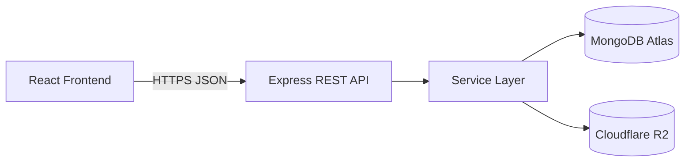

# Software Developer Portfolio — REST API Specification

## 1. Document Purpose

This document defines the REST API architecture and planned HTTP contracts for the Software Developer Portfolio.

It covers:

- API versioning
- Route structure
- Public endpoints
- Authentication endpoints
- Administrative endpoints
- Request conventions
- Response conventions
- Pagination
- Filtering
- Sorting
- Validation
- Authentication
- Authorization
- Error handling
- Rate limiting
- Security requirements

This document contains both implemented and planned endpoints.

An endpoint must not be considered implemented merely because it appears in this specification.

---

# 2. API Architecture

The portfolio uses a REST-style HTTP API provided by the Node.js/Express backend.

The frontend communicates with the backend through HTTPS.



---

# 3. API Base Path

All application endpoints are versioned under:

```text
/api/v1
```

Example development URL:

```text
http://localhost:5000/api/v1
```

A production API may eventually use a URL such as:

```text
https://api.example.com/api/v1
```

The final production hostname has not yet been selected.

---

# 4. API Versioning

The initial API version is:

```text
v1
```

Therefore:

```text
/api/v1
```

is the base application API.

If incompatible API changes are required in the future, another version may be introduced:

```text
/api/v2
```

Existing clients should not be broken unnecessarily.

---

# 5. Content Type

Normal API requests and responses use:

```http
Content-Type: application/json
```

Large media uploads will use a separate upload workflow and must not be encoded inside ordinary JSON requests.

---

# 6. Response Conventions

API responses should use predictable structures.

## Successful single-resource response

```json
{
  "success": true,
  "data": {}
}
```

## Successful collection response

```json
{
  "success": true,
  "data": []
}
```

## Successful collection with pagination

```json
{
  "success": true,
  "data": [],
  "pagination": {
    "page": 1,
    "limit": 10,
    "totalItems": 0,
    "totalPages": 0
  }
}
```

## Error response

```json
{
  "success": false,
  "message": "Request could not be completed"
}
```

Validation responses may additionally contain safe field-level details.

---

# 7. HTTP Status Codes

The API shall use appropriate HTTP status codes.

| Status | Meaning |
|---|---|
| `200 OK` | Successful request |
| `201 Created` | Resource successfully created |
| `204 No Content` | Successful operation with no response body where appropriate |
| `400 Bad Request` | Invalid or malformed request |
| `401 Unauthorized` | Authentication required or invalid |
| `403 Forbidden` | Authenticated client lacks permission |
| `404 Not Found` | Resource does not exist |
| `409 Conflict` | Resource conflict such as duplicate slug/email |
| `422 Unprocessable Content` | Semantic validation failure if adopted |
| `429 Too Many Requests` | Rate limit exceeded |
| `500 Internal Server Error` | Unexpected server failure |
| `503 Service Unavailable` | Required service unavailable where appropriate |

The implementation should avoid unnecessary variation between `400` and `422`. A consistent validation policy will be selected during implementation.

---

# 8. Current Implemented Endpoint

At the current implementation stage, the primary implemented endpoint is:

```http
GET /api/v1/health
```

Purpose:

- Verify the Express API is running.
- Support local/deployment health checks.

Expected response:

```json
{
  "success": true,
  "message": "Portfolio API is running"
}
```

Expected status:

```text
200 OK
```

---

# 9. Health Endpoint Evolution

Once MongoDB is connected, health monitoring may eventually distinguish between:

- Liveness
- Readiness

For example, a process may be alive while a required database dependency is unavailable.

The health endpoint must not expose sensitive infrastructure information.

It should not return:

- Database credentials
- Connection strings
- R2 credentials
- Internal hostnames unnecessarily
- Secret configuration

---

# 10. API Resource Groups

The planned API is divided into:

```text
Health
Public Projects
Public Categories
Public Settings
Contact
Authentication
Admin Projects
Admin Categories
Admin Media
Admin Enquiries
Admin Settings
```

Audit endpoints may be introduced if administrative audit visibility is required.

---

# 11. Planned Route Overview

```text
/api/v1
│
├── /health
│
├── /projects
├── /categories
├── /settings
├── /contact
│
├── /auth
│   ├── /login
│   ├── /logout
│   └── /me
│
└── /admin
    ├── /projects
    ├── /categories
    ├── /media
    ├── /enquiries
    ├── /settings
    └── /audit
```

Exact route details may be refined during implementation.

---

# 12. Public Projects API

## List Published Projects

```http
GET /api/v1/projects
```

Purpose:

Return projects eligible for public display.

Authentication:

```text
Not required
```

The backend must enforce:

```text
status = published
```

A client must not be able to retrieve drafts by manipulating query parameters.

---

# 13. Public Project Collection Response

Example:

```json
{
  "success": true,
  "data": [
    {
      "title": "Sign Natural Academy",
      "slug": "sign-natural-academy",
      "shortDescription": "A learning management platform.",
      "technologies": [
        "React",
        "Node.js",
        "Express",
        "MongoDB"
      ],
      "featured": true
    }
  ],
  "pagination": {
    "page": 1,
    "limit": 10,
    "totalItems": 1,
    "totalPages": 1
  }
}
```

The actual response fields will be finalized with the Project model and serializer.

---

# 14. Get Public Project

```http
GET /api/v1/projects/:slug
```

Example:

```http
GET /api/v1/projects/sign-natural-academy
```

Authentication:

```text
Not required
```

The backend must locate the project using:

- Slug
- Public publication state

A draft project must behave as unavailable through the public endpoint.

---

# 15. Public Project Not Found

If the slug does not exist or is not publicly accessible:

```text
404 Not Found
```

Example:

```json
{
  "success": false,
  "message": "Project not found"
}
```

The public API should not reveal whether a matching draft exists.

---

# 16. Public Project Filtering

Potential supported filters include:

```text
category
featured
```

Example:

```http
GET /api/v1/projects?featured=true
```

Potential category example:

```http
GET /api/v1/projects?category=full-stack-development
```

Only explicitly supported query parameters shall be accepted.

---

# 17. Public Project Pagination

Planned pagination parameters:

```text
page
limit
```

Example:

```http
GET /api/v1/projects?page=1&limit=9
```

The backend shall enforce:

- Minimum page
- Minimum limit
- Maximum limit

Clients must not be allowed to request unlimited result sets.

---

# 18. Public Project Sorting

Public sorting should use a controlled server-defined strategy.

Potential default ordering:

```text
featured
displayOrder
publishedAt
```

If client-controlled sorting is introduced, only approved fields shall be accepted.

Arbitrary MongoDB sort expressions must never be accepted.

---

# 19. Public Categories

Planned endpoint:

```http
GET /api/v1/categories
```

Authentication:

```text
Not required
```

Purpose:

Return categories intended for public project browsing/filtering.

Potential response:

```json
{
  "success": true,
  "data": [
    {
      "name": "Full-Stack Development",
      "slug": "full-stack-development"
    }
  ]
}
```

---

# 20. Public Portfolio Settings

Planned endpoint:

```http
GET /api/v1/settings/public
```

or an equivalent public settings route.

Purpose:

Provide safe portfolio-wide content such as:

- Professional headline
- Short biography
- Public social links
- CV reference
- Availability information

The exact route name will be finalized when `PortfolioSettings` is implemented.

---

# 21. Public Settings Security

The public settings endpoint must use an explicit safe projection.

It must never expose:

- Administrative metadata
- Internal identifiers unnecessarily
- Authentication information
- Infrastructure secrets
- R2 credentials
- Audit metadata

---

# 22. Contact Submission

Planned endpoint:

```http
POST /api/v1/contact
```

Authentication:

```text
Not required
```

Protection:

- Request validation
- Rate limiting
- Request-size limit
- Cloudflare Turnstile
- Abuse prevention

---

# 23. Contact Request

Potential request:

```json
{
  "name": "Example User",
  "email": "user@example.com",
  "subject": "Project enquiry",
  "message": "I would like to discuss a software development project.",
  "turnstileToken": "..."
}
```

The exact Turnstile field name will be finalized during implementation.

---

# 24. Contact Success Response

Potential response:

```json
{
  "success": true,
  "message": "Your message has been received."
}
```

Expected status:

```text
201 Created
```

if an enquiry record is created.

---

# 25. Contact Validation Failure

Example:

```json
{
  "success": false,
  "message": "Validation failed",
  "errors": {
    "email": "A valid email address is required."
  }
}
```

Validation responses must not expose internal validator implementation details.

---

# 26. Authentication API

Planned authentication routes:

```text
POST /api/v1/auth/login
POST /api/v1/auth/logout
GET  /api/v1/auth/me
```

There shall be no public registration endpoint.

---

# 27. No Public Registration

The API shall not expose:

```http
POST /api/v1/auth/register
```

for public administrator creation.

Administrator creation will use a controlled bootstrap/administrative mechanism.

---

# 28. Login

Planned endpoint:

```http
POST /api/v1/auth/login
```

Authentication:

```text
Public endpoint
```

Protection:

- Strict rate limiting
- Request validation
- Password verification
- Generic authentication failure responses
- Audit logging
- Secure cookie issuance

---

# 29. Login Request

Potential request:

```json
{
  "email": "admin@example.com",
  "password": "user-supplied-password"
}
```

The password must never be logged.

---

# 30. Login Success

Expected result:

- Credentials verified
- Authentication state established
- Secure HTTP-only cookie returned
- Safe administrator profile returned where required
- Audit event generated

Potential response:

```json
{
  "success": true,
  "data": {
    "admin": {
      "name": "Samuel Mensah Quaye",
      "email": "admin@example.com",
      "role": "admin"
    }
  }
}
```

The response must never include:

```text
password
passwordHash
authentication secret
raw session/token secret
```

---

# 31. Login Failure

Incorrect email and incorrect password should normally produce a generic authentication response.

Example:

```json
{
  "success": false,
  "message": "Invalid email or password"
}
```

This avoids unnecessarily confirming which administrator accounts exist.

---

# 32. Current Administrator

Planned endpoint:

```http
GET /api/v1/auth/me
```

Authentication:

```text
Required
```

Purpose:

Allow the frontend to determine the currently authenticated administrator.

Potential response:

```json
{
  "success": true,
  "data": {
    "admin": {
      "name": "Samuel Mensah Quaye",
      "email": "admin@example.com",
      "role": "admin"
    }
  }
}
```

---

# 33. Logout

Planned endpoint:

```http
POST /api/v1/auth/logout
```

Authentication:

Typically associated with the current browser authentication state.

Purpose:

- Invalidate or clear authentication state
- Clear authentication cookie
- Generate audit event where appropriate

Potential response:

```json
{
  "success": true,
  "message": "Logged out successfully"
}
```

---

# 34. Administrative API Boundary

Administrative resources shall exist under:

```text
/api/v1/admin
```

This provides a clear namespace but is not itself a security mechanism.

Every administrative route requiring protection must use authentication and authorization middleware.

---

# 35. Admin Project List

Planned endpoint:

```http
GET /api/v1/admin/projects
```

Authentication:

```text
Required
```

Authorization:

```text
Administrator
```

Unlike the public project endpoint, this endpoint may return:

- Drafts
- Published projects

subject to authorized filters.

---

# 36. Admin Project Retrieval

Planned endpoint:

```http
GET /api/v1/admin/projects/:id
```

The administrative interface may use MongoDB resource IDs internally.

Public project URLs continue to use slugs.

Invalid identifiers must be handled safely.

---

# 37. Create Project

Planned endpoint:

```http
POST /api/v1/admin/projects
```

Authentication:

```text
Required
```

Authorization:

```text
Administrator
```

Potential request:

```json
{
  "title": "Sign Natural Academy",
  "shortDescription": "A full-stack learning management platform.",
  "problem": "Project problem statement.",
  "solution": "Project solution.",
  "role": "Full-Stack Developer",
  "technologies": [
    "React",
    "Node.js",
    "Express",
    "MongoDB"
  ],
  "features": [],
  "challenges": [],
  "outcomes": [],
  "category": "CATEGORY_ID",
  "featured": false,
  "status": "draft"
}
```

The exact request schema will be finalized with the model and validator.

---

# 38. Project Creation Response

Expected status:

```text
201 Created
```

Potential response:

```json
{
  "success": true,
  "data": {
    "project": {}
  }
}
```

---

# 39. Update Project

Planned endpoint:

```http
PATCH /api/v1/admin/projects/:id
```

`PATCH` is preferred for partial updates.

Only explicitly permitted fields shall be accepted.

The backend must prevent mass assignment.

---

# 40. Project Publication

Publication may initially be handled through the project update endpoint.

Example:

```json
{
  "status": "published"
}
```

However, publication is a business operation rather than merely a field assignment.

The service must verify that the project satisfies publication requirements.

Potential future dedicated routes could include:

```text
POST /api/v1/admin/projects/:id/publish
POST /api/v1/admin/projects/:id/unpublish
```

A dedicated route should only be introduced if it improves the implementation or audit semantics.

---

# 41. Delete Project

Planned endpoint:

```http
DELETE /api/v1/admin/projects/:id
```

Authentication:

```text
Required
```

Authorization:

```text
Administrator
```

The service must consider:

- Associated media
- Shared media
- Audit logging
- Whether unpublishing is more appropriate

Deletion must not automatically destroy referenced R2 objects without checking their usage.

---

# 42. Admin Category List

Planned endpoint:

```http
GET /api/v1/admin/categories
```

Authentication:

```text
Required
```

---

# 43. Create Category

Planned endpoint:

```http
POST /api/v1/admin/categories
```

Potential request:

```json
{
  "name": "Full-Stack Development",
  "description": "Full-stack web application projects.",
  "displayOrder": 1
}
```

Slug may be generated server-side.

---

# 44. Update Category

Planned endpoint:

```http
PATCH /api/v1/admin/categories/:id
```

Only allowed category fields may be modified.

---

# 45. Delete Category

Planned endpoint:

```http
DELETE /api/v1/admin/categories/:id
```

Before deletion, the service must determine whether projects reference the category.

The system should not silently break existing project relationships.

---

# 46. Admin Media API

Planned media routes may include:

```text
GET    /api/v1/admin/media
POST   /api/v1/admin/media/upload-authorization
POST   /api/v1/admin/media/confirm
PATCH  /api/v1/admin/media/:id
DELETE /api/v1/admin/media/:id
```

The exact contract depends on the final Cloudflare R2 upload architecture.

---

# 47. Media List

Planned endpoint:

```http
GET /api/v1/admin/media
```

Authentication:

```text
Required
```

Supports:

- Pagination
- Media browsing
- Potential filtering by type
- Selection for projects/settings

---

# 48. Upload Authorization

Preferred target:

```http
POST /api/v1/admin/media/upload-authorization
```

Purpose:

1. Authenticate administrator.
2. Authorize upload.
3. Validate intended file metadata.
4. Generate controlled storage key.
5. Return temporary upload authorization.

The browser can then upload directly to R2 where the final design supports this safely.

---

# 49. Media Confirmation

Potential endpoint:

```http
POST /api/v1/admin/media/confirm
```

Purpose:

- Verify expected upload information
- Create `MediaAsset` metadata
- Associate the object with the administrative media library

The exact flow will be determined during R2 implementation.

---

# 50. Update Media Metadata

Potential endpoint:

```http
PATCH /api/v1/admin/media/:id
```

May update safe metadata such as:

```text
altText
caption
```

It should not allow arbitrary modification of infrastructure-controlled fields such as storage credentials.

---

# 51. Delete Media

Planned endpoint:

```http
DELETE /api/v1/admin/media/:id
```

Before deleting:

1. Validate identifier.
2. Authenticate.
3. Authorize.
4. Find media record.
5. Check project references.
6. Check portfolio/CV references.
7. Delete R2 object when safe.
8. Delete metadata.
9. Create audit event.

Referenced assets should not be deleted accidentally.

---

# 52. Admin Enquiry List

Planned endpoint:

```http
GET /api/v1/admin/enquiries
```

Authentication:

```text
Required
```

Potential filters:

```text
status
```

Pagination is required.

---

# 53. Admin Enquiry Retrieval

Planned endpoint:

```http
GET /api/v1/admin/enquiries/:id
```

Authentication:

```text
Required
```

---

# 54. Update Enquiry Status

Planned endpoint:

```http
PATCH /api/v1/admin/enquiries/:id
```

Potential request:

```json
{
  "status": "read"
}
```

Allowed statuses are controlled by the backend.

---

# 55. Delete Enquiry

Potential endpoint:

```http
DELETE /api/v1/admin/enquiries/:id
```

Deletion/retention behavior will be finalized when enquiry management is implemented.

---

# 56. Admin Settings

Planned endpoint:

```http
GET /api/v1/admin/settings
```

Authentication:

```text
Required
```

Returns the administrative representation of portfolio settings.

---

# 57. Update Settings

Planned endpoint:

```http
PATCH /api/v1/admin/settings
```

Potential editable fields:

- Headline
- Short biography
- About content
- Contact email
- Social links
- Availability
- SEO defaults
- CV reference

Only explicitly permitted fields shall be accepted.

---

# 58. Audit API

If the admin dashboard exposes audit history, a read-only endpoint may be introduced:

```http
GET /api/v1/admin/audit
```

Authentication:

```text
Required
```

Authorization:

```text
Appropriate administrator permission
```

Audit log mutation endpoints should not be casually exposed.

---

# 59. Authentication Cookies

Browser authentication is planned around HTTP-only cookies.

Frontend API requests requiring authentication will therefore need credentials enabled.

Conceptually:

```javascript
fetch(url, {
  credentials: 'include'
})
```

The actual frontend API service will centralize this behavior rather than repeating configuration throughout components.

---

# 60. Cookie Security

Production authentication cookies will use appropriate attributes including:

```text
HttpOnly
Secure
SameSite
Path
Expiration
```

The exact `SameSite` configuration depends on the final frontend/API domain topology.

It must be tested in the real production configuration.

---

# 61. CORS

The API uses an explicit frontend origin allowlist.

Environment example:

```env
CLIENT_URLS=http://localhost:5173,https://portfolio.example.com
```

Credentialed browser requests shall only receive CORS permission for explicitly trusted origins.

---

# 62. CORS Is Not Authorization

A request is not trusted simply because its origin is permitted.

Protected routes still require:

```text
Authentication
+
Authorization
```

Likewise, blocking an origin through CORS does not replace authentication.

---

# 63. Request Validation

Each write endpoint shall validate request input.

Validation includes:

- Required fields
- Type
- Length
- Format
- Enumerated values
- Object IDs
- URLs
- Email addresses
- Arrays
- Unexpected fields

Validation should occur before controller business operations.

---

# 64. Unknown Fields

Unexpected input fields should normally be rejected or explicitly discarded according to the validator policy.

For sensitive administrative operations, strict schemas are preferred.

This helps prevent mass assignment.

---

# 65. MongoDB Object IDs

Endpoints accepting database identifiers shall validate them before database queries.

Example:

```http
GET /api/v1/admin/projects/not-a-valid-id
```

should return a controlled client error rather than exposing a raw Mongoose CastError.

---

# 66. Slug Validation

Public project slugs shall be validated as URL-safe identifiers.

Example:

```text
sign-natural-academy
```

Slugs should not be passed directly into uncontrolled query objects.

---

# 67. Query Parameter Validation

Query parameters are untrusted input.

The backend shall explicitly validate:

```text
page
limit
sort
category
featured
status
```

where supported.

Unsupported query operators shall not be passed to MongoDB.

---

# 68. Pagination

Planned pagination:

```http
?page=1&limit=10
```

Example response:

```json
{
  "success": true,
  "data": [],
  "pagination": {
    "page": 1,
    "limit": 10,
    "totalItems": 42,
    "totalPages": 5
  }
}
```

A maximum limit shall be enforced server-side.

---

# 69. Pagination Validation

Examples:

```text
page >= 1
limit >= 1
limit <= server-defined maximum
```

Invalid values shall not become arbitrary database skip/limit operations.

---

# 70. Filtering

Filtering shall be resource-specific.

For example:

```http
GET /api/v1/projects?featured=true
```

Admin example:

```http
GET /api/v1/admin/projects?status=draft
```

The public API must always apply its mandatory publication restriction regardless of supplied filters.

---

# 71. Sorting

Only server-approved sorting fields shall be accepted.

Unsafe client-supplied database sort objects are prohibited.

Example future request:

```http
GET /api/v1/admin/projects?sort=createdAt
```

The backend maps the safe public value to a controlled database sort.

---

# 72. Request Body Limits

Normal API requests use conservative JSON and URL-encoded size limits.

Current baseline:

```text
100 KB
```

This limit may be adjusted based on actual case-study content requirements.

Media files must not be encoded as large JSON payloads.

---

# 73. Rate Limiting

The API uses layered rate limiting.

## General API

Baseline protection applies to:

```text
/api
```

## Authentication

Login requires a stricter dedicated limiter.

## Contact

Contact submissions require a dedicated abuse limiter.

## Media

Upload-authorization endpoints may require operation-specific limits.

---

# 74. Rate Limit Response

Typical status:

```text
429 Too Many Requests
```

Example:

```json
{
  "success": false,
  "message": "Too many requests. Please try again later."
}
```

Responses should not reveal unnecessary implementation details about security thresholds.

---

# 75. Authentication Failure

Unauthenticated access to protected endpoints should return:

```text
401 Unauthorized
```

Example:

```json
{
  "success": false,
  "message": "Authentication required"
}
```

---

# 76. Authorization Failure

An authenticated user lacking permission should receive:

```text
403 Forbidden
```

Example:

```json
{
  "success": false,
  "message": "You are not authorized to perform this action"
}
```

Error wording may be made more generic where disclosure would create security concerns.

---

# 77. Resource Not Found

Example:

```text
404 Not Found
```

```json
{
  "success": false,
  "message": "Project not found"
}
```

Public endpoints should avoid leaking the existence of protected resources.

---

# 78. Conflict

Example:

A duplicate project slug may result in:

```text
409 Conflict
```

```json
{
  "success": false,
  "message": "A project with this slug already exists"
}
```

Raw MongoDB duplicate-key errors shall not be returned.

---

# 79. Validation Error

Potential format:

```json
{
  "success": false,
  "message": "Validation failed",
  "errors": {
    "title": "Title is required",
    "liveUrl": "Live URL must be a valid URL"
  }
}
```

The exact error structure should remain consistent once implemented.

---

# 80. Unexpected Server Error

Production response:

```text
500 Internal Server Error
```

```json
{
  "success": false,
  "message": "Internal server error"
}
```

Production responses must not include:

- Stack traces
- Database errors
- Filesystem paths
- Environment variables
- Secret values

---

# 81. Development Errors

Development may expose additional diagnostic information where useful.

Sensitive configuration must still never be exposed.

Development mode does not justify logging passwords or secrets.

---

# 82. 404 API Handling

Unknown routes return:

```text
404 Not Found
```

Example:

```http
GET /api/v1/does-not-exist
```

Response:

```json
{
  "success": false,
  "message": "Route not found"
}
```

---

# 83. CSRF

Because browser authentication will use cookies, write operations must be evaluated for CSRF.

The final strategy may include:

- SameSite cookies
- Origin validation
- CSRF tokens where required

The exact implementation depends on production domain topology.

---

# 84. XSS Considerations

API input is not automatically safe because it is JSON.

User/admin-authored content must be safely rendered by the frontend.

If rich HTML is eventually supported, sanitization must occur according to an explicit policy.

---

# 85. NoSQL Injection

Request bodies and query strings shall not be passed directly to Mongoose query filters.

Unsafe:

```javascript
Model.find(req.query)
```

Preferred conceptual approach:

```text
Validate request
       ↓
Extract allowed fields
       ↓
Build controlled query
       ↓
Execute Mongoose operation
```

---

# 86. Mass Assignment

Administrative updates shall use field allowlists.

Unsafe:

```javascript
Model.findByIdAndUpdate(req.params.id, req.body)
```

unless `req.body` has already been strictly validated and transformed.

Protected fields must not be client-controlled accidentally.

---

# 87. API Data Projection

Different consumers require different representations.

For example:

```text
Public Project DTO
```

may contain fewer fields than:

```text
Admin Project DTO
```

Database documents should not automatically become API responses without considering data exposure.

---

# 88. Password Fields

The API must never return:

```text
password
passwordHash
```

under normal application behavior.

---

# 89. Internal Metadata

Public endpoints should not expose internal fields without a reason.

Examples:

```text
createdBy
updatedBy
internal audit references
database implementation details
```

---

# 90. Media URLs

The API may return a derived media delivery URL or sufficient information for the frontend to construct/use the approved delivery URL.

The final format depends on the R2 delivery architecture.

R2 secret credentials shall never appear in API responses.

---

# 91. Idempotency

GET requests shall not modify application state.

PUT, PATCH, POST, and DELETE semantics should be used intentionally.

The application primarily uses:

```text
GET
POST
PATCH
DELETE
```

`PUT` may be introduced where complete resource replacement is appropriate.

---

# 92. API Naming

Routes should use nouns rather than action-heavy endpoint names where standard REST semantics are sufficient.

Preferred:

```text
POST /projects
PATCH /projects/:id
DELETE /projects/:id
```

rather than:

```text
POST /createProject
POST /updateProject
POST /deleteProject
```

Dedicated action routes may still be appropriate for genuine domain actions such as publication.

---

# 93. API Controller Boundary

Routes delegate to controllers.

Conceptually:

```text
Route
  ↓
Validation
  ↓
Authentication
  ↓
Authorization
  ↓
Controller
  ↓
Service
```

Controllers should not contain large amounts of reusable business logic.

---

# 94. Service Boundary

Services handle operations such as:

```text
Create project
Publish project
Delete media
Verify media references
Authenticate administrator
Process contact enquiry
Update settings
```

This keeps HTTP concerns separate from application rules.

---

# 95. API Logging

API logging should eventually capture useful operational information such as:

- Request failures
- Authentication security events
- Unexpected exceptions
- Infrastructure failures

Logs must not include:

- Passwords
- Authentication cookies
- Session/token secrets
- R2 secret keys
- MongoDB credentials

---

# 96. Audit Events

Administrative actions should generate audit records independently of ordinary operational logging.

Example:

```text
project.updated
```

should identify:

- Actor
- Resource
- Action
- Timestamp
- Safe contextual metadata

---

# 97. Testing Requirements

Each implemented endpoint should eventually be covered by appropriate integration tests.

Examples:

```text
GET /health
GET /projects
GET /projects/:slug
POST /auth/login
GET /auth/me
POST /auth/logout
POST /admin/projects
PATCH /admin/projects/:id
DELETE /admin/projects/:id
POST /contact
```

Security tests should directly call protected endpoints rather than relying on frontend behavior.

---

# 98. API Documentation Maintenance

When an endpoint is implemented:

1. Confirm method.
2. Confirm route.
3. Document authentication.
4. Document authorization.
5. Document request schema.
6. Document response schema.
7. Document errors.
8. Add tests.
9. Update implementation status.

The API documentation must reflect the real implementation rather than an outdated architectural plan.

---

# 99. Current API Implementation Status

## Implemented/Foundation

Currently available or part of the backend foundation:

```text
GET /api/v1/health
```

Backend foundation also includes or is being refactored to include:

- CORS
- Helmet
- JSON parsing
- URL-encoded parsing
- Cookie parsing
- API rate limiting
- 404 handling
- Centralized error handling
- Versioned API router

---

## Planned

The following are specified but not yet implemented:

```text
GET    /api/v1/projects
GET    /api/v1/projects/:slug
GET    /api/v1/categories
GET    /api/v1/settings/public
POST   /api/v1/contact

POST   /api/v1/auth/login
POST   /api/v1/auth/logout
GET    /api/v1/auth/me

GET    /api/v1/admin/projects
POST   /api/v1/admin/projects
GET    /api/v1/admin/projects/:id
PATCH  /api/v1/admin/projects/:id
DELETE /api/v1/admin/projects/:id

GET    /api/v1/admin/categories
POST   /api/v1/admin/categories
PATCH  /api/v1/admin/categories/:id
DELETE /api/v1/admin/categories/:id

GET    /api/v1/admin/media
POST   /api/v1/admin/media/upload-authorization
POST   /api/v1/admin/media/confirm
PATCH  /api/v1/admin/media/:id
DELETE /api/v1/admin/media/:id

GET    /api/v1/admin/enquiries
GET    /api/v1/admin/enquiries/:id
PATCH  /api/v1/admin/enquiries/:id
DELETE /api/v1/admin/enquiries/:id

GET    /api/v1/admin/settings
PATCH  /api/v1/admin/settings

GET    /api/v1/admin/audit
```

These routes remain subject to refinement during implementation.

---

# 100. API Design Principles

The API shall follow these principles:

### Version explicitly

Application endpoints belong under `/api/v1`.

### Secure on the server

Frontend route protection does not replace API authorization.

### Validate before execution

Untrusted request data must be validated before business/database operations.

### Expose only necessary data

Database documents must not automatically become public responses.

### Protect publication state

Public APIs must never leak draft content.

### Avoid mass assignment

Only explicitly permitted fields may be modified.

### Use predictable responses

Successful and failed requests should follow consistent structures.

### Apply appropriate rate limits

Different endpoints have different abuse risks.

### Keep secrets server-side

API responses must never expose infrastructure or authentication secrets.

### Test failure paths

An endpoint is not complete merely because successful requests work.

---

# 101. Related Documentation

This API specification must remain aligned with:

```text
docs/requirements.md
docs/architecture.md
docs/database-design.md
docs/security.md
docs/threat-model.md
docs/testing.md
docs/troubleshooting.md
```

Changes to endpoint behavior that affect security, data models, or architecture must update the corresponding documentation.