# Software Developer Portfolio — System Architecture

## 1. Document Purpose

This document defines the system architecture for the Software Developer Portfolio.

It describes:

- System components
- Application boundaries
- Frontend architecture
- Backend architecture
- API architecture
- Database architecture
- Media architecture
- Authentication boundaries
- Security boundaries
- Data flows
- Deployment architecture
- Development principles

This document describes both the **approved target architecture** and the current implementation direction.

Components described as planned should not be interpreted as already implemented.

---

# 2. Architectural Goals

The architecture is designed around the following goals:

1. Maintainability
2. Security
3. Clear separation of responsibilities
4. Independent frontend and backend deployment
5. Dynamic portfolio content
6. Scalability appropriate to a personal portfolio
7. Testability
8. Deployment portability
9. Performance
10. Documentation
11. Future extensibility

The system should remain understandable enough for a single developer to maintain while following professional software-engineering practices.

---

# 3. High-Level Architecture

The application uses a decoupled client-server architecture.

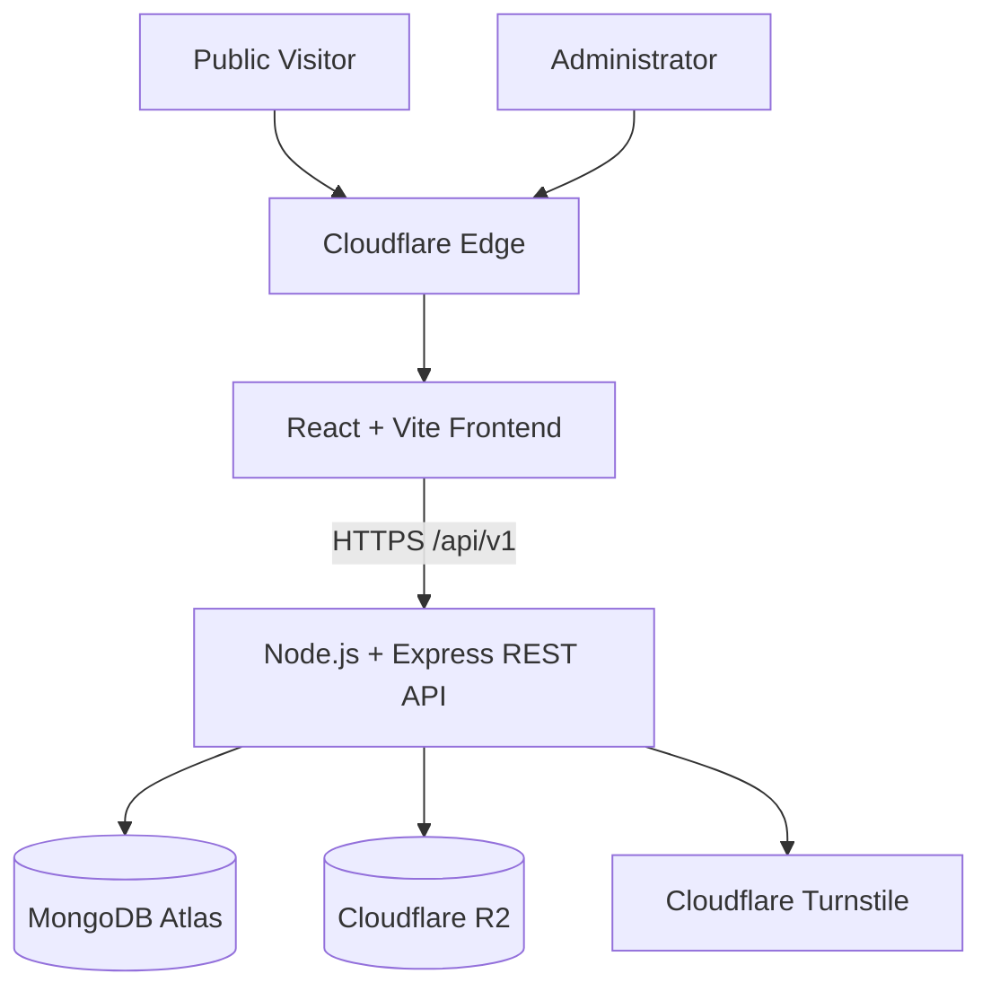

The primary architectural layers are:

```text
Browser
   ↓
Cloudflare
   ↓
React frontend
   ↓
HTTPS REST API
   ↓
Express backend
   ↓
Services
   ↓
MongoDB / R2 / external services
```

---

# 4. Architectural Style

The system uses:

- Single-page application architecture for the frontend
- REST architecture for application APIs
- Layered backend architecture
- Document-oriented database architecture
- Object storage for binary media
- Environment-based configuration
- Independent deployment boundaries

The project is **not** currently designed as a microservices system.

The portfolio does not require the operational complexity of microservices.

The Express backend remains one deployable application with clearly separated internal modules.

---

# 5. Repository Architecture

The repository follows a monorepository-style structure:

```text
software-developer-portfolio/
│
├── client/
│
├── server/
│
├── docs/
│
├── .github/
│   └── workflows/
│
├── .editorconfig
├── .gitignore
├── .nvmrc
├── package.json
└── README.md
```

Each major directory has a distinct responsibility.

---

# 6. Client Architecture

The frontend lives inside:

```text
client/
```

The target frontend structure is:

```text
client/
├── public/
│
├── src/
│   ├── assets/
│   ├── components/
│   ├── config/
│   ├── features/
│   │   ├── admin/
│   │   ├── contact/
│   │   ├── projects/
│   │   └── skills/
│   ├── hooks/
│   ├── layouts/
│   ├── pages/
│   │   ├── admin/
│   │   └── public/
│   ├── routes/
│   ├── services/
│   ├── utils/
│   ├── App.jsx
│   ├── index.css
│   └── main.jsx
│
├── .env.example
├── package.json
└── vite.config.js
```

The exact structure may evolve when real implementation needs justify it.

Directories should not be created solely for architectural appearance.

---

# 7. Frontend Responsibilities

The frontend is responsible for:

- Rendering the user interface
- Client-side routing
- Retrieving public portfolio data
- Displaying project case studies
- Contact form interaction
- Administrator interface
- Calling authenticated admin APIs
- User-facing loading/error states
- Responsive behavior
- Accessibility
- Client-side validation for usability
- SEO-related client metadata where appropriate

The frontend is **not responsible for authoritative security decisions**.

---

# 8. Frontend Configuration

Environment-dependent frontend configuration is provided through Vite environment variables.

Current baseline:

```env
VITE_API_BASE_URL=http://localhost:5000/api/v1
```

Configuration is exposed through:

```text
src/config/env.js
```

The frontend must never contain:

- MongoDB credentials
- R2 secret keys
- Authentication signing/session secrets
- Turnstile secret key
- Deployment secrets

Variables beginning with:

```text
VITE_
```

are browser-visible and must be treated as public configuration.

---

# 9. Frontend Routing

React Router is used for client-side navigation.

Target public routes include:

```text
/
/projects
/projects/:slug
/about
/skills
/contact
```

Administrative routes will exist under an admin namespace such as:

```text
/admin
/admin/login
/admin/projects
/admin/projects/new
/admin/projects/:id/edit
/admin/media
/admin/enquiries
/admin/settings
```

The exact admin route design will be finalized during implementation.

Frontend route protection improves user experience but does not provide backend authorization.

---

# 10. Dynamic Project Architecture

Projects shall not be hardcoded into React.

Instead:

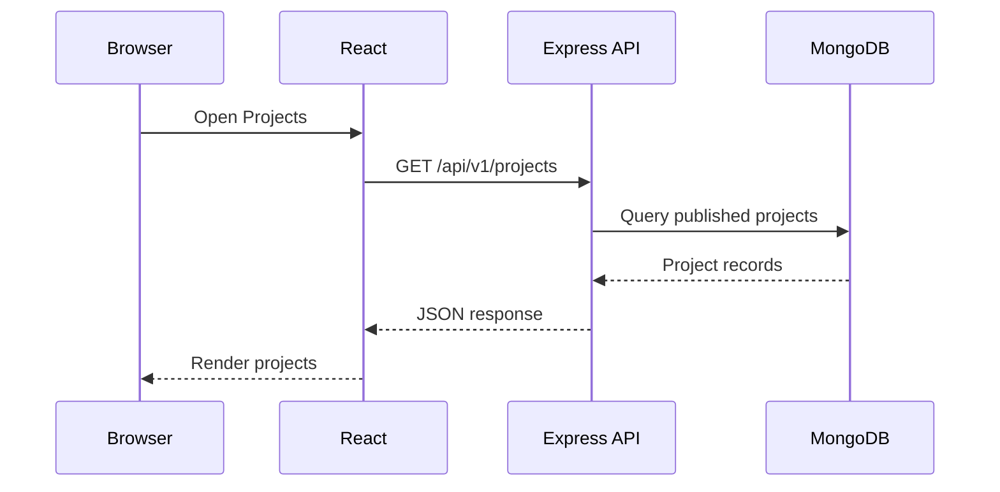

This allows new projects to be published through the administrative system without modifying frontend source code.

---

# 11. Backend Architecture

The backend lives inside:

```text
server/
```

The target structure is:

```text
server/
│
├── config/
│   ├── corsOptions.js
│   ├── db.js
│   └── env.js
│
├── controllers/
│
├── middlewares/
│   ├── authMiddleware.js
│   ├── errorMiddleware.js
│   ├── notFoundMiddleware.js
│   └── rateLimitMiddleware.js
│
├── models/
│
├── routes/
│   ├── healthRoutes.js
│   └── index.js
│
├── services/
│
├── utils/
│
├── validators/
│
├── app.js
├── server.js
├── .env.example
└── package.json
```

Not every listed file has been implemented yet.

This is the target modular structure.

---

# 12. Backend Layer Responsibilities

## 12.1 Configuration Layer

```text
config/
```

Responsible for:

- Environment configuration
- Database configuration
- CORS configuration
- Infrastructure configuration

Environment parsing should be centralized rather than repeated throughout the application.

---

## 12.2 Routes

```text
routes/
```

Routes define HTTP endpoints and connect them to:

- Validation
- Authentication
- Authorization
- Controllers

Routes should contain minimal business logic.

---

## 12.3 Controllers

```text
controllers/
```

Controllers manage the HTTP layer.

Responsibilities include:

- Reading validated request data
- Calling services
- Selecting HTTP status codes
- Returning responses

Controllers should not become large business-logic modules.

---

# 13. Services

```text
services/
```

Services contain reusable business and infrastructure logic.

Examples may eventually include:

```text
projectService.js
authService.js
mediaService.js
contactService.js
auditService.js
```

The service layer helps prevent controllers from becoming tightly coupled to database or infrastructure implementation.

---

# 14. Models

```text
models/
```

Models define MongoDB data structures through Mongoose.

Planned models include:

```text
Admin
Project
Category
MediaAsset
ContactEnquiry
PortfolioSettings
AuditLog
```

Detailed model design is maintained in:

```text
docs/database-design.md
```

---

# 15. Validators

```text
validators/
```

Validators define accepted request structures.

Validation should occur before business logic.

Validation includes:

- Required fields
- Data types
- Length constraints
- Enumerated values
- URLs
- Email addresses
- Identifiers
- Unexpected fields

Client-side validation does not replace backend validation.

---

# 16. Middleware

```text
middlewares/
```

Middleware handles cross-cutting HTTP concerns.

Examples include:

- Authentication
- Authorization
- Error handling
- 404 handling
- Rate limiting
- Request validation
- Security controls

Middleware should remain focused on cross-cutting request concerns rather than application business logic.

---

# 17. Application and Server Separation

The Express application shall be separated from HTTP process startup.

## `app.js`

Responsible for:

- Creating Express
- Applying middleware
- Mounting API routes
- Installing 404 handling
- Installing centralized error handling

## `server.js`

Responsible for:

- Loading startup configuration
- Establishing required infrastructure connections
- Starting the HTTP listener
- Process-level startup/shutdown behavior

Conceptually:

```text
server.js
    │
    ▼
app.js
    │
    ▼
Express application
```

This separation improves testing because integration tests can import the Express application without automatically opening a network port.

---

# 18. Backend Request Pipeline

The intended request flow is:

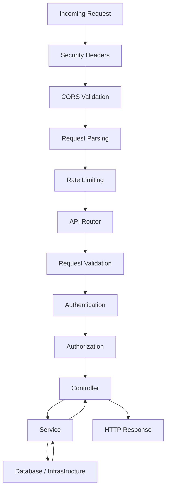

Not every endpoint requires authentication or authorization.

Public endpoints skip those controls where appropriate.

---

# 19. API Architecture

The backend exposes a versioned REST API.

Base:

```text
/api/v1
```

Current implemented health endpoint:

```text
GET /api/v1/health
```

Planned resources include:

```text
/projects
/categories
/auth
/admin/projects
/admin/categories
/admin/media
/admin/enquiries
/admin/settings
/contact
```

Exact routes are maintained in:

```text
docs/api.md
```

---

# 20. API Routing Architecture

The application mounts a central API router:

```text
app.js
   │
   ▼
/api/v1
   │
   ▼
routes/index.js
```

The central router then delegates requests.

Example:

```text
/api/v1
   │
   ├── /health
   ├── /projects
   ├── /categories
   ├── /auth
   ├── /contact
   │
   └── /admin
```

This keeps API versioning centralized.

---

# 21. Database Architecture

MongoDB Atlas is the primary application database.

Mongoose provides the ODM layer.

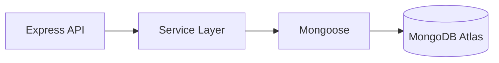

React does not connect directly to MongoDB.

All database access occurs through the backend.

---

# 22. Database Connection Architecture

The planned database configuration belongs in:

```text
server/config/db.js
```

Startup will eventually follow:

```text
Load environment
      ↓
Validate configuration
      ↓
Connect MongoDB
      ↓
Start Express listener
```

The server should not report itself ready before critical infrastructure initialization succeeds.

---

# 23. Primary Data Entities

The initial domain model contains:

```text
Admin
Project
Category
MediaAsset
ContactEnquiry
PortfolioSettings
AuditLog
```

Relationships are documented in:

```text
docs/database-design.md
```

---

# 24. Media Architecture

Binary media shall not be stored directly inside MongoDB.

The system separates:

```text
Media binary
    ↓
Cloudflare R2

Media metadata
    ↓
MongoDB
```

Examples of metadata include:

- Storage key
- MIME type
- Size
- Alt text
- Associated project
- Upload timestamp

---

# 25. Planned Media Upload Flow

The preferred target design is:

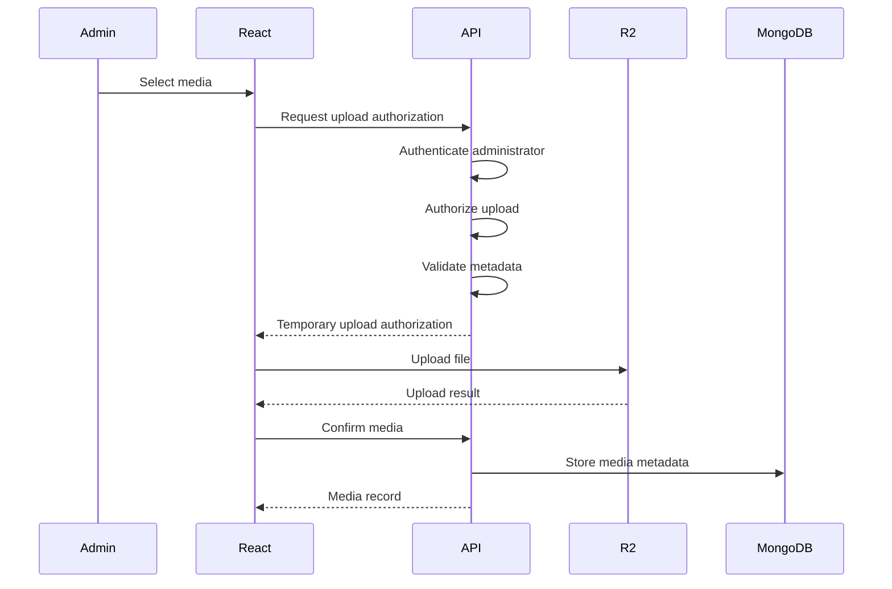

The exact R2 implementation will be finalized during the media phase.

This design avoids unnecessarily proxying large media payloads through Express when secure direct upload is appropriate.

---

# 26. Authentication Architecture

Administrator authentication is private.

There shall be no public registration.

Target architecture:

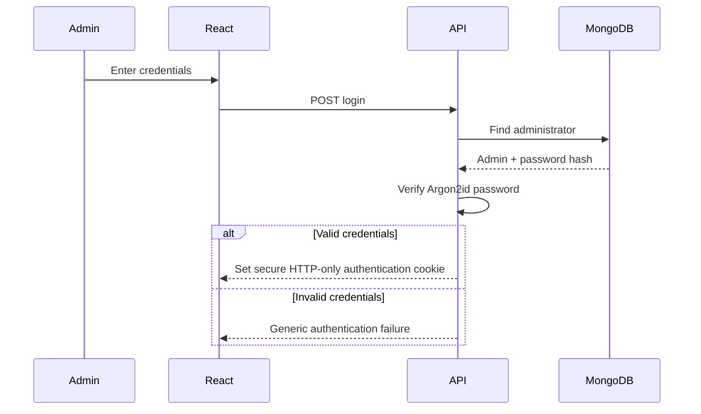

---

# 27. Password Architecture

Administrator passwords shall be hashed using:

```text
Argon2id
```

The database stores only password hashes.

The system shall never store or log plaintext passwords.

---

# 28. Browser Authentication State

Browser authentication shall use secure HTTP-only cookies.

This prevents JavaScript from directly reading authentication credentials.

Production cookie configuration will consider:

```text
HttpOnly
Secure
SameSite
Path
Expiration
```

The exact session/token design will be finalized during authentication implementation.

---

# 29. Authorization Architecture

Authentication answers:

> Who is making the request?

Authorization answers:

> Is that actor permitted to perform this action?

Authorization remains a backend responsibility.

Example:

```text
Request
   ↓
Authentication middleware
   ↓
Administrator identified
   ↓
Authorization policy
   ↓
Controller
```

React hiding an administrative control is not authorization.

---

# 30. Publication Security Boundary

Project publication state is enforced by the API.

Public project flow:

```text
GET /api/v1/projects
        ↓
Backend query
        ↓
status = published
        ↓
Public response
```

A visitor must not retrieve a draft simply by discovering:

- MongoDB ID
- Project slug
- API structure

Admin endpoints may retrieve drafts only after authorization.

---

# 31. CORS Architecture

The frontend and backend may run on different origins.

Therefore, Express uses explicit CORS configuration.

Approved environment design:

```env
CLIENT_URLS=http://localhost:5173,https://portfolio.example.com
```

The backend parses this into an allowlist.

Conceptually:

```text
Browser Origin
      ↓
CORS middleware
      ↓
Is origin explicitly allowed?
     / \
   yes  no
   /     \
allow   deny
```

Credentialed browser requests shall not use unrestricted wildcard origins.

---

# 32. Requests Without an Origin Header

Some legitimate clients may not provide an `Origin` header, including:

- API development tools
- `curl`
- Server-to-server clients

The CORS configuration may permit requests without an `Origin` header.

This does **not** bypass authentication or authorization.

CORS is a browser cross-origin policy and must not be treated as an access-control system.

---

# 33. Security Header Architecture

Helmet provides the backend HTTP security-header baseline.

Additional security policy, particularly Content Security Policy, will be reviewed against actual application requirements.

Security controls should not be disabled globally merely to resolve a development configuration problem.

---

# 34. Rate Limiting Architecture

The application uses layered rate limiting.

Baseline:

```text
General API limiter
```

Additional planned limiters:

```text
Login limiter
Contact limiter
Media-operation limiter
```

Conceptually:

```text
Request
   ↓
General API limit
   ↓
Endpoint-specific limit
   ↓
Endpoint
```

Different endpoints have different abuse profiles and should not necessarily share identical limits.

---

# 35. Request Validation Architecture

Validation occurs before business operations.

```text
Untrusted request
      ↓
Validation
      ↓
Normalized/accepted data
      ↓
Controller
      ↓
Service
```

Request objects should not be passed directly into MongoDB operations.

---

# 36. Error Handling Architecture

Errors flow to centralized error middleware.

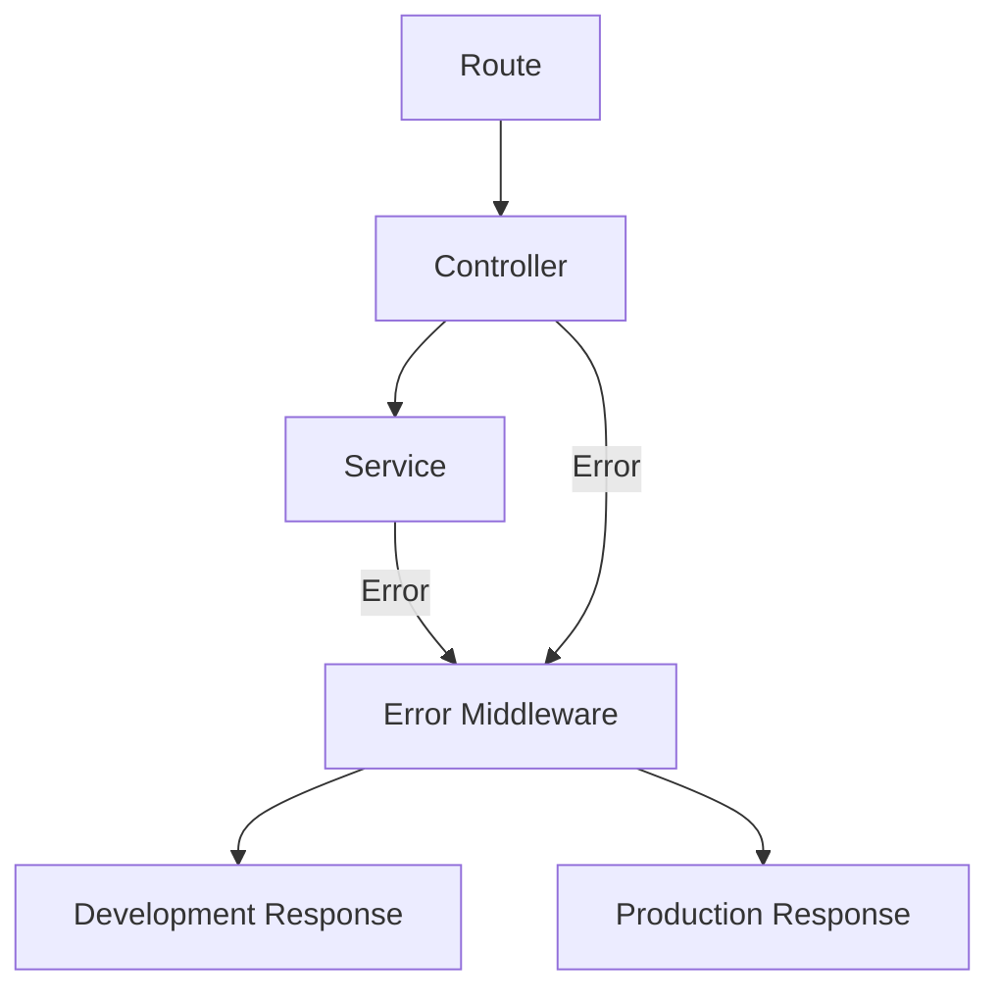

Production responses must hide sensitive internal details.

---

# 37. 404 Architecture

Requests that do not match an application route flow to dedicated 404 middleware before the centralized error handler.

Example response:

```json
{
  "success": false,
  "message": "Route not found"
}
```

---

# 38. Contact Architecture

Target flow:

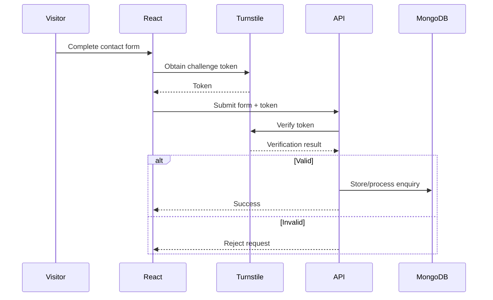

Additional controls include:

- Validation
- Rate limiting
- Request-size limits
- Safe output rendering

---

# 39. Audit Architecture

Security-relevant administrative operations shall generate audit events.

Conceptually:

```text
Administrator action
        ↓
Authorized operation
        ↓
Business result
        ↓
Audit event
        ↓
AuditLog
```

Audit logging should not expose:

- Passwords
- Session values
- Secret keys
- Authentication tokens

---

# 40. Trust Boundaries

The architecture contains several important trust boundaries.

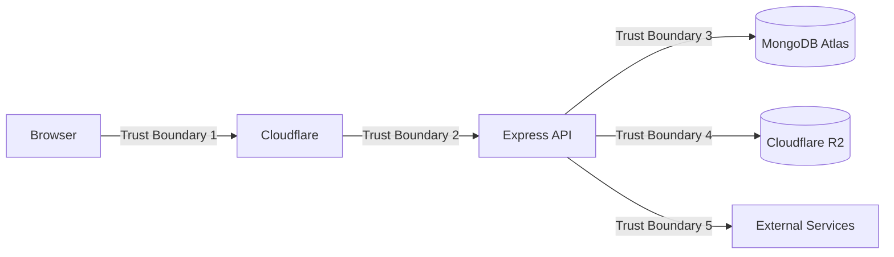

Data crossing a trust boundary must be treated according to its source and validated appropriately.

---

# 41. Secret Boundaries

Secrets may exist only in trusted server/deployment environments.

```text
React Browser
    ✗ MongoDB credentials
    ✗ R2 secret keys
    ✗ auth secrets
    ✗ Turnstile secret

Express Server
    ✓ MongoDB credentials
    ✓ R2 credentials
    ✓ auth secrets
    ✓ Turnstile secret
```

Frontend source code is not a secret-storage mechanism.

---

# 42. Environment Architecture

Configuration differs by environment.

Expected environments may include:

```text
development
test
production
```

Environment configuration shall control:

- API URLs
- Database connection
- Trusted frontend origins
- Authentication secrets
- R2 credentials
- Turnstile credentials
- Environment-sensitive security behavior

---

# 43. Development Deployment Architecture

Local development:

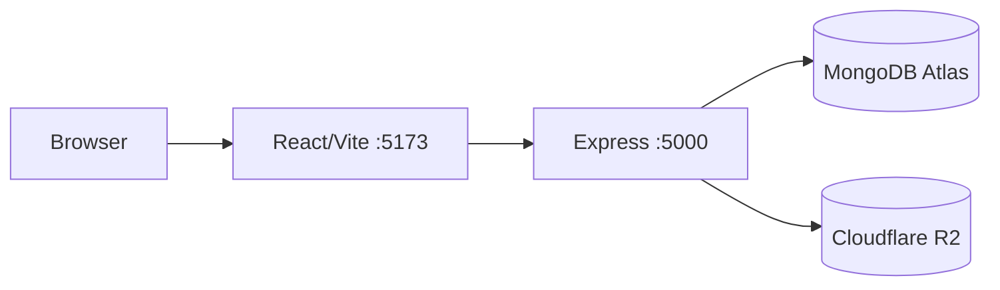

During early development, MongoDB/R2 connections may not yet exist.

---

# 44. Production Deployment Architecture

Target production architecture:

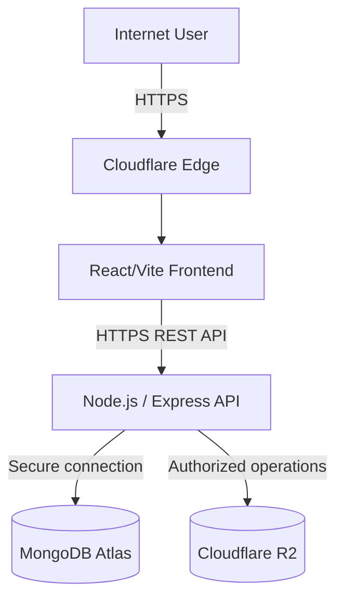

The backend hosting provider is intentionally not treated as permanent architecture.

---

# 45. Frontend Hosting Portability

The frontend is designed for Cloudflare deployment.

However, application code should avoid unnecessary dependencies on hosting-specific behavior.

Cloudflare-specific functionality should be introduced only where it provides a clear benefit.

---

# 46. Backend Hosting Portability

The Express application shall remain portable across compatible Node.js environments.

Application business logic should not depend directly on a single hosting provider unless unavoidable.

Provider-specific configuration belongs at infrastructure/deployment boundaries.

---

# 47. Database Portability

MongoDB Atlas is the selected database.

The service/model architecture should nevertheless prevent controllers from becoming unnecessarily dependent on low-level database operations.

This improves maintainability even though database replacement is not currently a project objective.

---

# 48. Media Portability

Cloudflare R2 is the selected media storage provider.

Media operations should be centralized through a service layer rather than spread throughout controllers.

For example:

```text
Controller
    ↓
mediaService
    ↓
R2
```

This also improves testing.

---

# 49. Observability

Production architecture should eventually provide visibility into:

- Application startup failures
- API errors
- Authentication failures
- Infrastructure failures
- Database connectivity
- Media failures
- Security events

Sensitive values must not be logged.

The exact monitoring platform has not yet been selected.

---

# 50. Graceful Shutdown

The production backend should eventually handle termination signals gracefully.

Target behavior:

```text
Termination signal
       ↓
Stop accepting new work
       ↓
Close HTTP resources
       ↓
Close database connection
       ↓
Exit process
```

This will be implemented after database/server lifecycle architecture is established.

---

# 51. API Testability

Separating:

```text
app.js
```

from:

```text
server.js
```

allows automated tests to import the Express application without starting the production listener.

Conceptually:

```text
Tests
  ↓
import app
  ↓
HTTP integration test
```

instead of:

```text
Tests
  ↓
start external server manually
```

---

# 52. CI/CD Architecture

The planned delivery pipeline is:

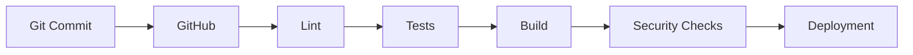

The exact GitHub Actions workflows will be created during the CI/CD phase.

---

# 53. Architectural Security Principle

The architecture follows:

```text
Client input is untrusted.
```

Therefore:

```text
Frontend validation
        ↓
Convenience

Backend validation
        ↓
Security boundary
```

Likewise:

```text
Frontend route protection
        ↓
User experience

Backend authorization
        ↓
Security boundary
```

---

# 54. Least Privilege

Infrastructure credentials should have only the permissions required by the application.

Examples:

### MongoDB

Application database credentials should not receive unnecessary administrative permissions.

### Cloudflare R2

R2 credentials should be scoped to required bucket operations.

### CI/CD

Deployment tokens should be limited to required deployment actions.

---

# 55. Architectural Simplicity

The project should not introduce unnecessary complexity merely to imitate large distributed systems.

Currently unnecessary technologies include, unless future requirements justify them:

- Microservices
- Kubernetes
- Message brokers
- Multiple databases
- Distributed caches
- Service meshes

The architecture should evolve because requirements demand it, not because a technology is fashionable.

---

# 56. Current Implementation Status

## Implemented

The current project includes:

- React/Vite frontend foundation
- Tailwind CSS
- ESLint
- Frontend environment configuration
- Node/Express backend foundation
- Helmet
- CORS foundation
- Cookie parser
- Request-size limits
- General API rate limiter
- Health endpoint
- Basic 404 handling
- Basic centralized error handling

---

## Currently Being Refactored

The backend is being separated into:

```text
config/
routes/
middlewares/
controllers/
services/
models/
validators/
```

with:

```text
app.js
server.js
```

having separate responsibilities.

---

## Approved but Not Yet Implemented

The following are target architecture rather than completed functionality:

- MongoDB connection
- Mongoose models
- Admin authentication
- Argon2id
- Secure authentication cookies
- Authorization middleware
- Project API
- Category API
- Media API
- R2 integration
- Contact API
- Turnstile
- Settings API
- Audit logging
- Automated backend tests
- Public application pages
- Admin dashboard
- CI/CD
- Production Cloudflare deployment
- Monitoring
- Graceful shutdown

---

# 57. Architectural Decision Rule

When introducing a new dependency, service, pattern, or infrastructure component, it should answer at least one concrete requirement.

The preferred decision sequence is:

```text
Requirement
    ↓
Constraint
    ↓
Design options
    ↓
Security implications
    ↓
Chosen architecture
    ↓
Implementation
    ↓
Testing
    ↓
Documentation
```

Technology should follow requirements rather than define them.

---

# 58. Documentation Relationship

This document describes system structure.

Related documents:

```text
requirements.md
    → What the system must do

architecture.md
    → How the system is structured

database-design.md
    → How application data is modeled

api.md
    → HTTP interface contracts

security.md
    → Security controls

threat-model.md
    → Threats and mitigations

local-development.md
    → Local setup and workflow

testing.md
    → Verification strategy

cloudflare-deployment.md
    → Cloudflare-specific deployment

production-deployment.md
    → Production deployment process

troubleshooting.md
    → Known problems and diagnostics
```

These documents should remain synchronized as the implementation evolves.

---

# 59. Architecture Status

This architecture is the approved baseline for the Software Developer Portfolio.

It is expected to evolve as implementation reveals new requirements, but changes should preserve the core principles of:

- Security
- Clear responsibility boundaries
- Dynamic content
- Independent deployment
- Maintainability
- Testability
- Documentation