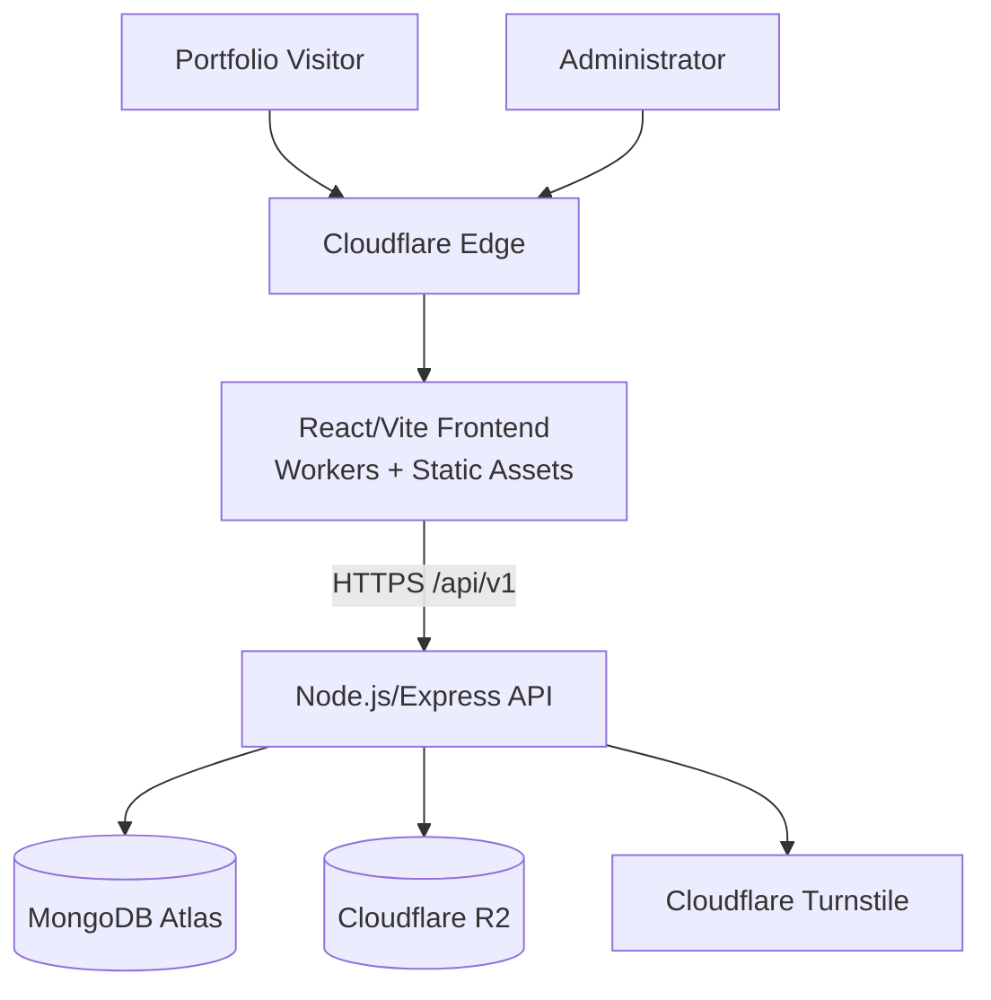
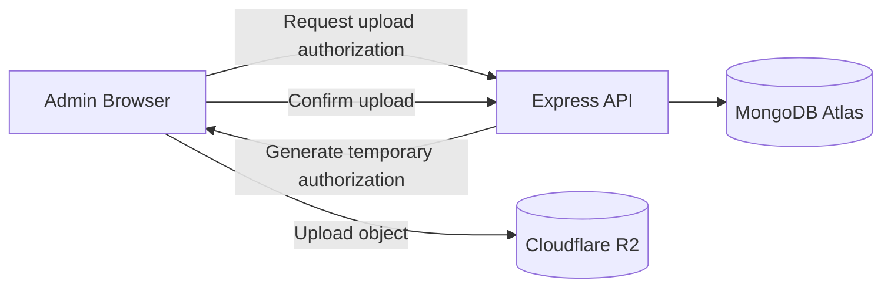
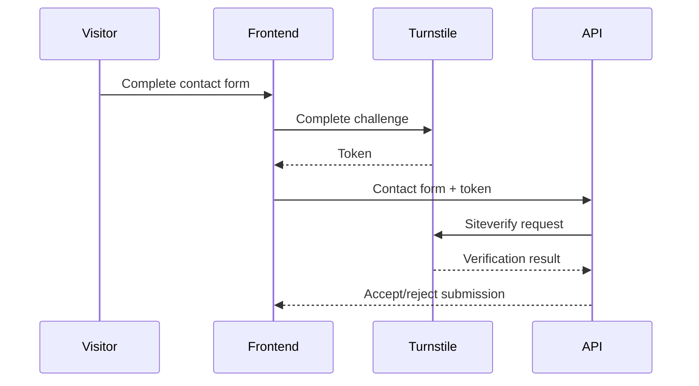
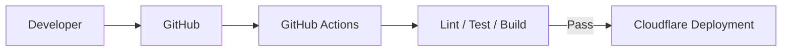

# Software Developer Portfolio — Cloudflare Deployment

## 1. Document Purpose

This document defines the planned Cloudflare architecture and deployment process for the Software Developer Portfolio.

It covers:

- Cloudflare architecture
- Frontend deployment
- Cloudflare Workers with Static Assets
- Vite integration
- Environment configuration
- SPA routing
- Cloudflare R2
- Media delivery
- R2 upload architecture
- Cloudflare Turnstile
- Custom domains
- DNS
- HTTPS
- Caching
- Security
- CI/CD
- Deployment verification
- Rollback considerations

The portfolio has not yet been deployed using this architecture.

This document therefore distinguishes between:

```text
Approved architecture
Planned configuration
Future implementation
Production verification
```

Exact commands and configuration must be checked against current Cloudflare documentation when the deployment phase begins.

---

# 2. Cloudflare Responsibilities

Cloudflare is planned to provide several services for the portfolio:

```text
Frontend hosting
Edge delivery
TLS/HTTPS
Cloudflare R2 media storage
Cloudflare Turnstile
DNS when a custom domain is introduced
Additional edge security controls
```

The Node.js/Express API remains independently deployable.

---

# 3. High-Level Production Architecture



---

# 4. Separation of Responsibilities

The architecture intentionally separates:

```text
Frontend
Backend
Database
Object storage
```

into independently manageable components.

### Frontend

```text
Cloudflare Workers with Static Assets
```

### Backend

```text
Node.js / Express
```

deployed to a suitable Node.js hosting environment.

### Database

```text
MongoDB Atlas
```

### Media

```text
Cloudflare R2
```

This prevents the frontend hosting decision from tightly coupling the entire system to one deployment provider.

---

# 5. Frontend Deployment Decision

The selected frontend deployment target is:

```text
Cloudflare Workers with Static Assets
```

rather than relying on Cloudflare Pages as the long-term architectural default.

The frontend remains a standard React/Vite application.

---

# 6. Why Workers with Static Assets

The architecture provides:

- Static asset delivery through Cloudflare
- Vite compatibility
- Edge delivery
- Future Worker capabilities
- Custom-domain support
- Controlled routing
- Integration with the wider Cloudflare platform

The React application itself remains portable.

---

# 7. Frontend Build

The frontend is located in:

```text
client/
```

The normal production build is:

```powershell
cd client
npm run build
```

Vite generates the production frontend output.

The exact generated deployment configuration may depend on the Cloudflare/Vite integration selected during implementation.

---

# 8. Build Validation

Before deployment:

```powershell
npm run lint
npm run build
```

Both should succeed.

A successful development server does not guarantee a successful production build.

---

# 9. Static Assets

Cloudflare Workers can serve static assets generated by the frontend build.

The portfolio frontend consists primarily of:

```text
HTML
JavaScript
CSS
Images/icons bundled with frontend
Other static resources
```

Dynamic portfolio media such as project screenshots will primarily use Cloudflare R2 rather than being permanently bundled into the frontend build.

---

# 10. Dynamic Content

The deployed React frontend shall not contain the complete project portfolio as hardcoded build-time content.

Instead:

```text
React frontend
      ↓
REST API
      ↓
MongoDB Atlas
```

retrieves dynamic project data.

This allows future projects to be added through the admin interface without rebuilding frontend source code merely to add a project.

---

# 11. Frontend API Configuration

The frontend uses:

```text
VITE_API_BASE_URL
```

Development:

```env
VITE_API_BASE_URL=http://localhost:5000/api/v1
```

Production will use the deployed backend URL.

Example:

```env
VITE_API_BASE_URL=https://api.example.com/api/v1
```

The real production hostname will be configured during deployment.

---

# 12. Vite Variables Are Public

Values beginning with:

```text
VITE_
```

become available to browser-delivered frontend code.

Therefore:

```text
VITE_API_BASE_URL
```

is acceptable.

The following are not:

```text
VITE_MONGODB_URI
VITE_R2_SECRET_ACCESS_KEY
VITE_SESSION_SECRET
VITE_TURNSTILE_SECRET_KEY
```

Secrets must never be placed in the frontend build.

---

# 13. Cloudflare Configuration

The final Cloudflare deployment will use the configuration format supported by the selected version of Wrangler and the Cloudflare Vite integration.

The project may use configuration such as:

```text
wrangler.jsonc
```

or another currently supported Wrangler configuration format.

Exact configuration will be created during the deployment phase rather than prematurely locking the project to an outdated format.

---

# 14. Compatibility Date

When a Worker configuration requires a compatibility date, it shall use an intentionally selected date appropriate to the deployment.

It should not be copied indefinitely from documentation examples.

The compatibility date should be reviewed when Cloudflare runtime behavior is upgraded.

---

# 15. SPA Routing

The portfolio uses React Router.

Routes may include:

```text
/
/projects
/projects/:slug
/about
/skills
/contact
/admin/*
```

Direct navigation to these routes must still load the React application.

Example:

```text
https://portfolio.example.com/projects/sign-natural-academy
```

must not produce an infrastructure-level static-file 404 simply because:

```text
/projects/sign-natural-academy
```

does not correspond to a physical HTML file.

---

# 16. SPA Fallback

Cloudflare static-asset routing shall be configured so client-side routes appropriately fall back to the SPA entry point.

Conceptually:

```text
Request /projects/example
        ↓
No physical static file
        ↓
Serve SPA entry
        ↓
React Router handles route
```

The exact configuration will be confirmed against the Cloudflare deployment mechanism used.

---

# 17. API Routing

The frontend and API remain separate applications.

Frontend:

```text
https://portfolio.example.com
```

Potential backend:

```text
https://api.example.com
```

The browser communicates with:

```text
https://api.example.com/api/v1
```

The final hostname architecture will be selected during production deployment.

---

# 18. CORS

Because frontend and API may use different origins, the backend must explicitly allow the production frontend.

Example:

```env
CLIENT_URLS=http://localhost:5173,https://portfolio.example.com
```

Credentialed requests must not use wildcard CORS.

---

# 19. Multiple Deployment Origins

During deployment, trusted origins may temporarily include:

```text
Local development origin
Cloudflare deployment hostname
Custom production domain
```

Only origins actually required should remain trusted.

Old temporary deployment origins should be removed when no longer necessary.

---

# 20. Preview Deployment Security

Cloudflare-generated preview or temporary deployment URLs should not automatically gain administrative API access merely because they belong to Cloudflare.

If preview environments require backend access, their origins should be deliberately configured.

Do not use an unrestricted pattern equivalent to:

```text
*.workers.dev
```

for credentialed administrative access without a carefully designed validation strategy.

---

# 21. Custom Domain

A custom domain is not required for initial development.

The project can be deployed and tested using the hostname Cloudflare provides for the Worker deployment.

A custom domain may be attached later.

---

# 22. Custom Domain Architecture

Potential production layout:

```text
www.example.com
```

or:

```text
example.com
```

for the frontend.

Potential API:

```text
api.example.com
```

This arrangement can simplify professional branding and infrastructure organization.

---

# 23. Domain Purchase

The domain does not have to be purchased before frontend development or initial Cloudflare deployment.

A domain becomes necessary when the portfolio should use a branded public hostname.

---

# 24. DNS

When a custom domain is introduced, Cloudflare DNS may manage records for:

```text
Root domain
www
API subdomain
Other required services
```

DNS changes should be documented before production cutover.

---

# 25. HTTPS

Production portfolio traffic shall use:

```text
HTTPS
```

Cloudflare will participate in TLS delivery for the frontend/custom domain.

The backend must also be reachable securely over HTTPS.

---

# 26. Mixed Content

The production frontend must not call:

```text
http://
```

API endpoints from an:

```text
https://
```

page.

Production API configuration must therefore use HTTPS.

---

# 27. Cloudflare R2

Cloudflare R2 is the selected object-storage platform for portfolio media.

Potential stored objects include:

```text
Project cover images
Project gallery images
CV PDF
Other portfolio media
```

R2 stores binary objects.

MongoDB stores metadata and references.

---

# 28. R2 Architecture



This is the preferred architecture.

---

# 29. Why Direct Browser Upload

Uploading directly to R2 using temporary authorization can avoid routing large media files through the Express server.

Benefits include:

- Reduced backend bandwidth
- Reduced backend memory pressure
- Better separation of responsibilities
- Easier scaling

Permanent R2 credentials remain server-side.

---

# 30. R2 Presigned URLs

R2 supports temporary presigned URLs for specific S3-compatible operations.

The backend may generate a short-lived URL allowing an authenticated administrator to upload a specific object.

Conceptually:

```text
Administrator
      ↓
POST upload authorization
      ↓
Express verifies authentication
      ↓
Express validates intended file
      ↓
Express generates object key
      ↓
Express generates temporary PUT authorization
      ↓
Browser uploads directly to R2
```

---

# 31. Presigned URL Scope

Temporary upload authorization should be restricted by:

- Specific object
- Specific operation
- Short expiration
- Expected content type where appropriate

A presigned URL should not provide general bucket administration.

---

# 32. Presigned URL Security

Anyone possessing a valid presigned URL may be able to perform the operation authorized by that URL until it expires.

Therefore:

- Use short expiration
- Never log URLs unnecessarily
- Generate them only for authenticated/authorized administrators
- Scope them to specific objects
- Avoid exposing them beyond the required workflow

---

# 33. R2 CORS

Browser uploads to R2 using presigned URLs require appropriate bucket CORS configuration.

The R2 CORS policy should allow only required origins, methods, and headers.

Conceptually:

```text
Allowed origins:
- local development
- production portfolio/admin origin

Allowed methods:
- PUT where required
- GET/HEAD where required

Allowed headers:
- only those needed by upload workflow
```

The final policy will be created when R2 integration is implemented.

---

# 34. R2 Credentials

Server-side configuration may include:

```env
R2_ACCOUNT_ID=
R2_ACCESS_KEY_ID=
R2_SECRET_ACCESS_KEY=
R2_BUCKET_NAME=
```

These values belong in:

```text
server/.env
```

during local development and secure backend environment configuration in production.

---

# 35. R2 Least Privilege

R2 credentials should have only the permissions required by the application.

The application should not use broad account-level administrative credentials when bucket/object-level permissions are sufficient.

---

# 36. R2 Object Keys

The backend should generate object keys.

Example:

```text
projects/sign-natural-academy/uuid-cover.webp
```

or another controlled naming structure.

The client-supplied filename must not directly become the storage path.

---

# 37. R2 File Validation

Before issuing upload authorization, validate metadata including:

- Intended file type
- File size
- Resource purpose

Where required, additional validation may occur after upload.

---

# 38. Media Metadata

MongoDB `MediaAsset` documents store information such as:

```text
objectKey
bucket
originalName
mimeType
size
width
height
altText
caption
uploadedBy
createdAt
updatedAt
```

R2 remains responsible for the binary object itself.

---

# 39. Public Media Delivery

Portfolio images need public browser delivery.

The final delivery architecture may use:

- An R2 public/custom delivery hostname
- Cloudflare Worker-controlled delivery
- Another supported Cloudflare R2 delivery mechanism

The exact approach will be selected during implementation.

---

# 40. Public Read vs Administrative Write

Portfolio media may intentionally be publicly readable.

That does not mean the bucket should provide public write access.

Conceptually:

```text
Visitors
   ↓
READ

Administrator
   ↓
Authenticated temporary WRITE
```

Write access remains protected.

---

# 41. Media Caching

Public portfolio images are strong candidates for caching.

Object keys should support safe caching behavior.

If immutable/versioned object keys are used, long-lived caching becomes easier.

Replacing an image may create a new object key instead of mutating the same cached object.

---

# 42. CV Storage

The downloadable CV may also be stored in R2.

MongoDB settings can reference its `MediaAsset`.

This allows the administrator to replace the CV without modifying frontend source code.

---

# 43. CV Delivery

Public visitors should be able to access the approved CV.

Administrative replacement remains protected.

The architecture should separate:

```text
Public CV read
```

from:

```text
Administrative CV write/delete
```

---

# 44. Cloudflare Turnstile

Cloudflare Turnstile is planned for the public contact form.

Its purpose is to reduce automated abuse and spam.

---

# 45. Turnstile Architecture



---

# 46. Server-Side Turnstile Validation

Turnstile validation must occur on the backend.

The frontend widget alone does not prove a valid request.

The backend sends the received token to Cloudflare's Siteverify API and only accepts the protected operation when verification succeeds.

---

# 47. Turnstile Token Characteristics

Turnstile tokens are temporary and single-use.

The application must not treat a previously validated token as a permanent authentication mechanism.

If a token expires or is reused, the frontend should obtain a fresh token where appropriate.

---

# 48. Turnstile Keys

Turnstile uses:

```text
Site key
Secret key
```

The site key is intended for client-side use.

The secret key is private.

Backend:

```env
TURNSTILE_SECRET_KEY=
```

The secret must never be placed in:

```text
VITE_*
```

frontend configuration.

---

# 49. Turnstile Is Not the Only Abuse Control

Contact protection will combine:

```text
Turnstile
+
Validation
+
Rate limiting
+
Request-size limits
```

Turnstile does not replace application-level controls.

---

# 50. Cloudflare Worker Secrets

If future Worker-side functionality requires sensitive values, Cloudflare Worker secrets should be used rather than plaintext configuration variables.

Sensitive values must not be committed into Wrangler configuration.

---

# 51. Frontend Worker Secrets

The current React frontend is expected to require little or no sensitive Worker-side configuration because:

```text
Browser frontend
```

should not hold backend secrets.

If Worker server-side logic is added later, its secrets must be managed through Cloudflare's secret facilities.

---

# 52. Local Cloudflare Secrets

If Worker-side secrets are introduced during local development, use Cloudflare-supported local secret/environment mechanisms.

Files containing real secrets must remain ignored by Git.

Do not maintain duplicate conflicting secret files unnecessarily.

---

# 53. Deployment Authentication

Manual or CI deployment requires authorization to the Cloudflare account.

Deployment credentials must not be committed to the repository.

---

# 54. CI/CD Cloudflare Token

Future GitHub Actions deployment may require a Cloudflare API token.

The token should be stored as a protected GitHub repository/environment secret.

It must not appear directly inside:

```text
.github/workflows/*
```

---

# 55. Cloudflare API Token Scope

CI/CD tokens should follow least privilege.

A deployment token should receive only the permissions necessary to deploy the required application resources.

Avoid using broad account-global credentials when a narrower token is sufficient.

---

# 56. Deployment Environments

Future deployment may distinguish:

```text
Development
Preview/Staging
Production
```

Configuration should not assume that all environments share the same:

- API hostname
- CORS origins
- secrets
- R2 bucket
- Turnstile configuration

---

# 57. Environment Isolation

Where separate Cloudflare environments are introduced, configuration and secrets must be explicitly managed per environment.

Production secrets must not automatically become development secrets.

---

# 58. Frontend Production Variables

The production frontend requires at least:

```text
VITE_API_BASE_URL
```

Potential future public configuration may include:

```text
VITE_TURNSTILE_SITE_KEY
```

These values are public by design.

---

# 59. Backend Production Variables

The independently deployed backend may require:

```env
NODE_ENV=production
PORT=

MONGODB_URI=
SESSION_SECRET=
CLIENT_URLS=

R2_ACCOUNT_ID=
R2_ACCESS_KEY_ID=
R2_SECRET_ACCESS_KEY=
R2_BUCKET_NAME=

TURNSTILE_SECRET_KEY=
```

The actual authentication secret naming may change when authentication implementation is finalized.

---

# 60. Cloudflare Does Not Host Backend Secrets Automatically

Deploying the frontend to Cloudflare does not mean backend secrets belong in Cloudflare frontend configuration.

Because the Express API is independently deployed:

```text
Backend secrets
```

belong in the backend hosting environment.

---

# 61. Caching Strategy

Public static frontend assets should benefit from Cloudflare caching.

Potential categories:

```text
HTML
Hashed JavaScript
Hashed CSS
Static icons
Public project media
```

Dynamic API responses require a separate caching strategy.

---

# 62. Hashed Frontend Assets

Vite production builds generally generate fingerprinted asset names.

These are suitable for long-lived caching because content changes generate new asset names.

Caching behavior should still be verified after deployment.

---

# 63. HTML Caching

The SPA entry HTML should not be cached so aggressively that new deployments remain inaccessible for excessive periods.

The final cache policy should allow deployment updates to propagate correctly.

---

# 64. API Caching

Administrative and authentication API responses should not be cached publicly.

Public project endpoints may eventually use controlled caching if appropriate.

Caching must never cause:

- Draft leakage
- Admin data leakage
- Authentication-state leakage

---

# 65. Cache Invalidation

Where dynamic public content is cached, publication/update workflows must consider cache invalidation or suitable TTLs.

A project update should not leave stale public content indefinitely.

The initial implementation may avoid complex API caching until it is necessary.

---

# 66. Cloudflare Security Headers

Security headers may be delivered by:

- Express
- Cloudflare Worker
- Cloudflare configuration

Responsibilities should remain clear.

Duplicate or conflicting security-header policies should be avoided.

---

# 67. Content Security Policy

The production frontend should eventually use a CSP compatible with:

- Application scripts
- API connection
- R2/media delivery
- Turnstile
- Required external resources

The policy should be based on the actual deployed application.

---

# 68. CSP Verification

After deployment, verify CSP in the browser.

Look for blocked legitimate resources and unexpected permitted sources.

Do not weaken CSP globally merely to silence an error without understanding which resource requires permission.

---

# 69. Clickjacking Protection

The portfolio/admin interface should not be unnecessarily embeddable by arbitrary websites.

The final framing policy should be verified through response headers/CSP.

---

# 70. Cloudflare WAF

Cloudflare security capabilities may provide additional protection depending on the selected account configuration.

Application security must not depend exclusively on WAF rules.

The backend must remain secure when called directly.

---

# 71. Backend Origin Exposure

If the Node/Express backend has a publicly reachable hostname, attackers may call it without visiting the Cloudflare-hosted frontend.

Therefore the backend independently requires:

```text
Authentication
Authorization
Validation
Rate limiting
CORS
Safe errors
```

---

# 72. CORS Is Not Backend Firewalling

Restricting:

```text
CLIENT_URLS
```

controls browser cross-origin access.

It does not prevent:

```text
curl
scripts
bots
direct HTTP clients
```

from sending requests.

Protected resources require authentication and authorization.

---

# 73. Backend Hosting

The backend hosting provider has not yet been finalized.

Requirements include:

- Node.js 22+ support
- Environment secrets
- HTTPS
- Stable outbound MongoDB connectivity
- Suitable logging
- Health checks
- Controlled deployment
- Appropriate proxy configuration
- Ability to support secure cookies

The architecture intentionally allows the backend host to change later.

---

# 74. MongoDB Atlas

MongoDB Atlas remains independent from Cloudflare frontend hosting.

Backend:

```text
Express API
     ↓
MongoDB Atlas
```

The browser must never connect directly to Atlas.

---

# 75. MongoDB Network Access

Production Atlas network access should be configured based on the selected backend host.

Cloudflare frontend addresses are not relevant to direct MongoDB access because the frontend does not connect to MongoDB.

---

# 76. Deployment Flow

Planned frontend deployment flow:

```text
Developer
   ↓
GitHub
   ↓
CI/CD or deployment command
   ↓
Vite production build
   ↓
Cloudflare Worker deployment
   ↓
Static assets served at edge
```

---

# 77. Future CI/CD Flow

Potential architecture:



Production deployment should not occur when critical checks fail.

---

# 78. CI/CD Quality Gates

Before production deployment:

```text
Frontend lint
Frontend build
Backend tests
Security regression tests
Relevant integration tests
```

should pass once those checks are implemented.

---

# 79. Manual Initial Deployment

The first Cloudflare deployment may be performed manually while the architecture is being verified.

This allows us to confirm:

- Build output
- Routing
- Environment variables
- API connectivity
- CORS
- R2
- Turnstile
- Custom domain behavior

before automating deployment.

---

# 80. Automated Deployment

Once manual deployment is stable, GitHub Actions may automate deployment.

Automation should reproduce the proven deployment process rather than becoming the place where deployment is first debugged.

---

# 81. Deployment Branch

Production deployment should normally originate from:

```text
main
```

Development/integration occurs primarily through:

```text
develop
```

or focused feature branches.

The exact GitHub workflow will be defined during CI/CD implementation.

---

# 82. Preview Deployment

Preview deployments may be useful before merging production changes.

If introduced, they should use:

- Appropriate API environment
- Explicit CORS
- Appropriate secrets
- Non-production data where possible

Preview deployments must not accidentally gain unrestricted production administration access.

---

# 83. Deployment Verification

After deploying the frontend, verify:

```text
[ ] Root page loads
[ ] Static assets load
[ ] React Router works
[ ] Direct nested URL navigation works
[ ] API requests work
[ ] CORS works
[ ] HTTPS works
[ ] Browser console has no unexpected errors
```

---

# 84. Public Portfolio Verification

Verify:

```text
[ ] Homepage loads
[ ] Projects load dynamically
[ ] Project case studies open
[ ] Project images load
[ ] External links work
[ ] About page works
[ ] Skills page works
[ ] CV works
[ ] Contact form works
```

---

# 85. Admin Verification

Verify:

```text
[ ] Admin login works
[ ] Authentication cookie works
[ ] Admin API works
[ ] Project creation works
[ ] Project editing works
[ ] Publication works
[ ] Media management works
[ ] Enquiries work
[ ] Settings work
[ ] Logout works
```

only after those features are implemented.

---

# 86. Security Deployment Verification

Verify:

```text
[ ] HTTPS enforced
[ ] Production CORS correct
[ ] Secure authentication cookies
[ ] Draft projects unavailable publicly
[ ] Admin API rejects unauthenticated requests
[ ] Production errors hide stack traces
[ ] Security headers present
[ ] R2 secrets absent from frontend
[ ] MongoDB URI absent from frontend
[ ] Turnstile secret absent from frontend
```

---

# 87. R2 Deployment Verification

Verify:

```text
[ ] Public media loads
[ ] Admin can request upload authorization
[ ] Valid upload succeeds
[ ] Invalid file rejected
[ ] Oversized file rejected
[ ] R2 CORS works
[ ] Media metadata stored
[ ] Referenced asset cannot be deleted accidentally
[ ] Permanent R2 credentials never reach browser
```

---

# 88. Turnstile Deployment Verification

Verify:

```text
[ ] Widget loads
[ ] Token generated
[ ] Token sent with contact request
[ ] Backend validates token
[ ] Invalid token rejected
[ ] Reused token rejected
[ ] Contact rate limiting remains active
```

---

# 89. Custom Domain Verification

When a domain is attached:

```text
[ ] DNS resolves
[ ] HTTPS certificate valid
[ ] Root domain works
[ ] www behavior intentional
[ ] API domain works if used
[ ] CORS updated
[ ] Authentication cookie behavior verified
[ ] Turnstile hostname configuration updated
[ ] Canonical URLs updated
```

---

# 90. Authentication Domain Considerations

Cookie behavior depends partly on the relationship between:

```text
Frontend domain
API domain
```

Example:

```text
example.com
api.example.com
```

may behave differently from unrelated domains.

Final:

```text
SameSite
Secure
Domain
Path
```

settings must be tested using the real production topology.

---

# 91. SEO After Domain Change

When moving from a temporary Cloudflare hostname to a custom domain, update as appropriate:

- Canonical URLs
- Sitemap
- Robots configuration
- Open Graph URLs
- Structured metadata
- API/frontend configuration

The final SEO implementation will be completed with the frontend.

---

# 92. Temporary Deployment Hostname

A temporary Cloudflare-provided hostname is acceptable for initial deployment and testing.

It should not necessarily be treated as the permanent canonical portfolio URL.

---

# 93. Deployment Logs

Deployment output should be reviewed for:

- Build warnings
- Missing configuration
- Failed asset uploads
- Routing issues
- Dependency warnings

Sensitive values must not be intentionally printed into deployment logs.

---

# 94. Runtime Monitoring

Production monitoring should eventually observe:

```text
Frontend availability
Backend health
API errors
Authentication failures
MongoDB connectivity
R2 failures
Turnstile failures
```

The exact monitoring platform has not yet been selected.

---

# 95. Cloudflare Analytics

Cloudflare-provided analytics may help understand:

- Requests
- Traffic
- Errors
- Security events
- Turnstile validation behavior

Analytics should complement application monitoring rather than replace backend observability.

---

# 96. Turnstile Monitoring

Unexpectedly high invalid-token rates may indicate:

- Bot traffic
- Expired tokens
- Replay attempts
- Implementation problems

Turnstile behavior should therefore be monitored after launch.

---

# 97. Deployment Rollback

A failed production deployment should be recoverable.

The final deployment workflow should maintain a known-good version or provide a documented rollback mechanism.

Rollback should restore application availability without requiring emergency source edits.

---

# 98. Database Rollback

Frontend rollback does not automatically undo database changes.

Schema/data migrations must therefore be designed carefully.

Destructive database changes should not be tightly coupled to a deployment without a recovery plan.

---

# 99. R2 Rollback

Likewise, application rollback does not automatically restore deleted R2 objects.

Media deletion and replacement workflows require independent integrity controls.

---

# 100. Deployment Security Review

Before first production launch:

```text
[ ] No secrets in repository
[ ] No secrets in frontend bundle
[ ] Cloudflare deployment credentials least privilege
[ ] R2 credentials least privilege
[ ] MongoDB credentials least privilege
[ ] Production CORS explicit
[ ] Authentication secure
[ ] CSRF strategy verified
[ ] CSP reviewed
[ ] Turnstile server verification active
[ ] Rate limiting active
[ ] Production error handling active
[ ] Proxy configuration reviewed
```

---

# 101. Cloudflare Configuration Review

Because Cloudflare evolves independently of the application, exact deployment syntax should be verified against current Cloudflare documentation before production deployment.

Particular areas to verify include:

```text
Wrangler configuration
Workers Static Assets
Vite integration
SPA routing
Custom domains
R2 CORS
Presigned URLs
Turnstile
Secrets
CI/CD authentication
```

This prevents outdated documentation from becoming the deployment authority.

---

# 102. Current Implementation Status

## Approved

The following architectural decisions are approved:

```text
Cloudflare frontend hosting
Workers with Static Assets
React/Vite frontend
Cloudflare R2
Temporary authorized direct R2 uploads
Cloudflare Turnstile
Independent Express backend
MongoDB Atlas
Custom domain optional initially
```

---

## Partially Implemented

The frontend currently has:

```text
React
Vite
Tailwind CSS
Frontend environment configuration
Production build capability
```

The backend has foundational API infrastructure.

---

## Not Yet Implemented

The following remain planned:

```text
Cloudflare Worker deployment configuration
Production Cloudflare project
R2 bucket integration
R2 presigned upload workflow
R2 media delivery configuration
R2 CORS
Turnstile integration
Custom domain
Production DNS
Production backend deployment
Cloudflare CI/CD
Production CSP
Production monitoring
Deployment rollback procedure
```

---

# 103. Deployment Implementation Order

When deployment work begins:

```text
1. Complete application functionality
2. Complete automated tests
3. Verify production frontend build
4. Select/configure backend host
5. Configure production MongoDB
6. Configure R2
7. Configure Turnstile
8. Create Cloudflare frontend deployment
9. Configure frontend API URL
10. Configure backend CORS
11. Verify temporary Cloudflare hostname
12. Perform security tests
13. Add custom domain when desired
14. Configure DNS
15. Verify production cookie behavior
16. Configure CI/CD
17. Add monitoring
18. Document rollback
```

The sequence may be adjusted where infrastructure dependencies require it.

---

# 104. Deployment Completion Criteria

Cloudflare deployment is complete only when:

```text
[ ] Production build succeeds
[ ] Cloudflare deployment succeeds
[ ] Static assets load
[ ] SPA routing works
[ ] API connectivity works
[ ] HTTPS works
[ ] CORS works
[ ] Public portfolio works
[ ] Admin authentication works
[ ] R2 media works
[ ] Turnstile works
[ ] Security checks pass
[ ] Production smoke tests pass
[ ] Deployment documentation matches reality
```

---

# 105. Related Documentation

This deployment architecture must remain aligned with:

```text
docs/requirements.md
docs/architecture.md
docs/database-design.md
docs/api.md
docs/security.md
docs/threat-model.md
docs/local-development.md
docs/testing.md
docs/production-deployment.md
docs/troubleshooting.md
```

Cloudflare-specific implementation changes affecting security, routing, media, authentication, or deployment must also update the corresponding technical documentation.