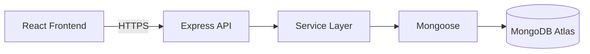
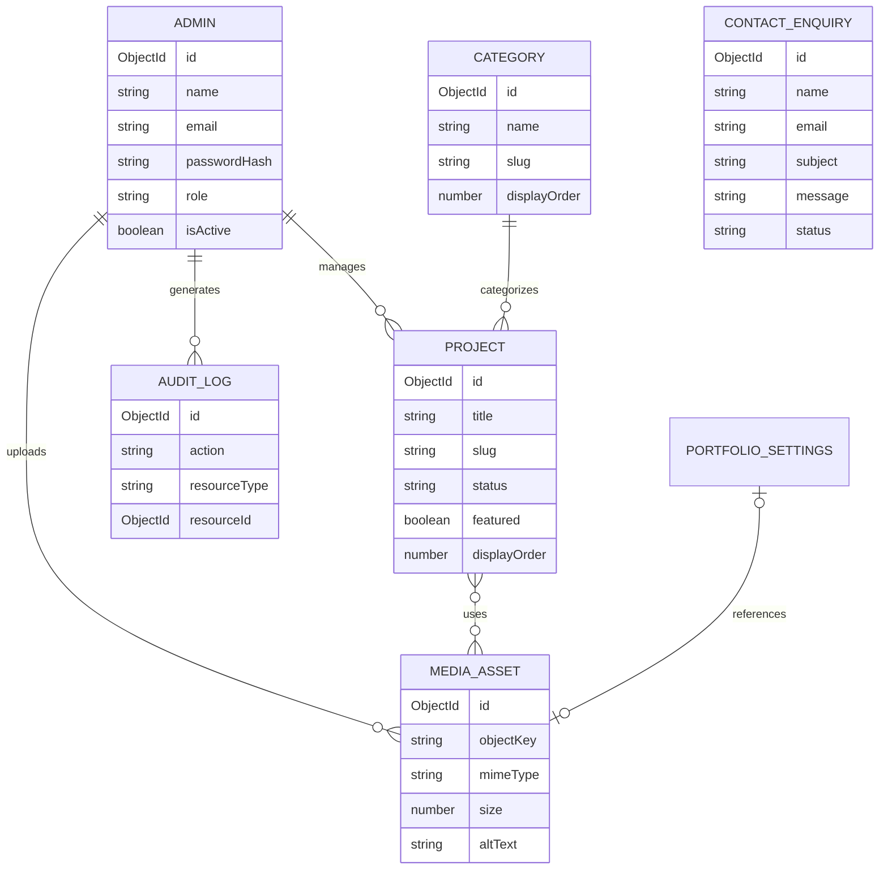

# Software Developer Portfolio — Database Design

## 1. Document Purpose

This document defines the planned database architecture, collections, relationships, constraints, indexes, validation rules, and data lifecycle for the Software Developer Portfolio.

The primary database is:

**MongoDB Atlas**

The backend Object Document Mapper is:

**Mongoose**

This document is the database-design baseline. Exact implementation details may be refined when the Mongoose models are created.

---

# 2. Database Objectives

The database shall support:

1. Dynamic project management
2. Project publication
3. Project categorization
4. Administrator authentication
5. Media metadata
6. Contact enquiries
7. Portfolio-wide settings
8. Administrative audit logging
9. Efficient public project retrieval
10. Future expansion without unnecessary schema redesign

---

# 3. Database Architecture

The browser shall never communicate directly with MongoDB.

The expected data flow is:



MongoDB credentials exist only in the trusted backend environment.

---

# 4. Database Connection

The MongoDB connection string shall be provided through an environment variable:

```env
MONGODB_URI=
```

It shall never be:

- Hardcoded into source files
- Committed to Git
- Included in frontend environment variables
- Returned by API responses
- Printed in public logs

The connection configuration will eventually be centralized in:

```text
server/config/db.js
```

---

# 5. Initial Collections

The initial domain model consists of:

```text
admins
projects
categories
mediaassets
contactenquiries
portfoliosettings
auditlogs
```

Corresponding Mongoose models are expected to be:

```text
Admin
Project
Category
MediaAsset
ContactEnquiry
PortfolioSettings
AuditLog
```

---

# 6. Entity Relationship Overview



The exact relationship implementation may use:

- ObjectId references
- Embedded subdocuments
- Controlled denormalization

depending on the access pattern.

---

# 7. Admin Model

The `Admin` model represents authorized portfolio administrators.

There shall be no public administrator registration.

Proposed schema:

```text
Admin
├── _id
├── name
├── email
├── passwordHash
├── role
├── isActive
├── lastLoginAt
├── passwordChangedAt
├── createdAt
└── updatedAt
```

---

# 8. Admin Fields

## `_id`

Type:

```text
ObjectId
```

Generated by MongoDB.

---

## `name`

Type:

```text
String
```

Requirements:

- Required
- Trimmed
- Reasonable maximum length

---

## `email`

Type:

```text
String
```

Requirements:

- Required
- Unique
- Normalized
- Lowercase
- Trimmed
- Valid email format

A unique index shall be created.

---

## `passwordHash`

Type:

```text
String
```

Requirements:

- Required
- Never returned by normal API serialization
- Contains an Argon2id password hash

The database shall never contain the administrator's plaintext password.

---

## `role`

Initial value may be:

```text
admin
```

or:

```text
super_admin
```

The exact role terminology will be finalized during authentication implementation.

Even if the application initially has one administrator, explicitly modelling authorization provides a cleaner foundation for future expansion.

---

## `isActive`

Type:

```text
Boolean
```

Default:

```text
true
```

Allows administrative access to be disabled without immediately deleting the account.

---

## `lastLoginAt`

Type:

```text
Date
```

Updated following successful authentication.

---

## `passwordChangedAt`

Type:

```text
Date
```

Can be used to invalidate older authentication sessions/tokens depending on the final authentication architecture.

---

# 9. Admin Security Requirements

The Admin model must:

- Never expose `passwordHash` unnecessarily
- Never store plaintext passwords
- Normalize email addresses
- Enforce unique email identity
- Support account disabling
- Support password-change tracking
- Avoid storing authentication tokens in plaintext if persistent token records are later introduced

---

# 10. Project Model

The `Project` model is the central content entity.

Proposed structure:

```text
Project
├── _id
├── title
├── slug
├── shortDescription
├── problem
├── solution
├── role
├── caseStudy
├── technologies[]
├── features[]
├── challenges[]
├── outcomes[]
├── category
├── coverImage
├── media[]
├── liveUrl
├── repositoryUrl
├── featured
├── status
├── displayOrder
├── publishedAt
├── createdBy
├── updatedBy
├── createdAt
└── updatedAt
```

---

# 11. Project Title

Field:

```text
title
```

Type:

```text
String
```

Requirements:

- Required
- Trimmed
- Length constrained

Example:

```text
Sign Natural Academy
```

---

# 12. Project Slug

Field:

```text
slug
```

Type:

```text
String
```

Requirements:

- Required
- Unique
- Lowercase
- URL-safe
- Indexed

Example:

```text
sign-natural-academy
```

Public URL:

```text
/projects/sign-natural-academy
```

The slug provides stable human-readable public URLs.

---

# 13. Short Description

Field:

```text
shortDescription
```

Type:

```text
String
```

Used for:

- Project cards
- Featured project summaries
- Search/social metadata where appropriate

It should have a reasonable maximum length.

---

# 14. Project Case Study Fields

The project may contain structured case-study fields such as:

```text
problem
solution
role
caseStudy
```

Structured content is preferred over a single uncontrolled HTML field where practical.

This makes content:

- Easier to validate
- Safer to render
- Easier to restructure
- Easier to expose through APIs

---

# 15. Technologies

Field:

```text
technologies
```

Possible representation:

```text
Array<String>
```

Example:

```json
[
  "React",
  "Node.js",
  "Express",
  "MongoDB",
  "Tailwind CSS"
]
```

Values shall be normalized and validated.

A dedicated technology collection is not currently required.

It may be introduced later only if technology metadata becomes independently manageable.

---

# 16. Features

Field:

```text
features
```

Type:

```text
Array<String>
```

Example:

```json
[
  "Role-based access control",
  "Course management",
  "Progress tracking",
  "Quiz management"
]
```

---

# 17. Challenges

Field:

```text
challenges
```

Type:

```text
Array<String>
```

Used to describe technical or implementation challenges encountered during the project.

---

# 18. Outcomes

Field:

```text
outcomes
```

Type:

```text
Array<String>
```

Used for measurable or meaningful project results.

---

# 19. Project Category

Field:

```text
category
```

Preferred representation:

```text
ObjectId → Category
```

A project initially belongs to one primary category.

If implementation later demonstrates a real requirement for multiple categories, the relationship may be changed to an array.

The schema should not be made many-to-many prematurely.

---

# 20. Cover Image

Field:

```text
coverImage
```

Preferred representation:

```text
ObjectId → MediaAsset
```

The project should reference media metadata rather than embedding R2 secret/storage credentials.

---

# 21. Project Media

Field:

```text
media
```

Preferred representation:

```text
Array<ObjectId → MediaAsset>
```

This supports multiple:

- Screenshots
- Interface images
- Architecture images
- Other project media

Ordering requirements may later require relationship metadata or an explicit ordered array.

---

# 22. Live URL

Field:

```text
liveUrl
```

Type:

```text
String
```

Optional.

Must be validated as an allowed URL format.

Example:

```text
https://example.com
```

---

# 23. Repository URL

Field:

```text
repositoryUrl
```

Type:

```text
String
```

Optional.

Some project repositories may intentionally remain private.

The application must not require every project to expose source code publicly.

---

# 24. Featured Project

Field:

```text
featured
```

Type:

```text
Boolean
```

Default:

```text
false
```

Used to select projects for prominent display.

---

# 25. Project Status

Field:

```text
status
```

Initial allowed values:

```text
draft
published
```

Default:

```text
draft
```

Public endpoints must only return projects whose publication state permits public access.

---

# 26. Published Date

Field:

```text
publishedAt
```

Type:

```text
Date
```

Expected behavior:

- `null` while never published
- Set when first published
- Publication semantics finalized in service logic

The application should avoid resetting historical publication timestamps accidentally during ordinary edits.

---

# 27. Display Order

Field:

```text
displayOrder
```

Type:

```text
Number
```

Used for controlled project ordering.

Default ordering behavior should be explicitly defined by project service/query logic.

---

# 28. Project Audit References

Fields may include:

```text
createdBy
updatedBy
```

Type:

```text
ObjectId → Admin
```

These fields provide lightweight ownership/change attribution.

Detailed action history belongs in `AuditLog`.

---

# 29. Category Model

Proposed structure:

```text
Category
├── _id
├── name
├── slug
├── description
├── displayOrder
├── createdAt
└── updatedAt
```

---

# 30. Category Name

Field:

```text
name
```

Requirements:

- Required
- Trimmed
- Unique or appropriately constrained

Examples might eventually include:

```text
Full-Stack Development
Frontend Development
Web Applications
```

Categories should reflect actual portfolio content rather than being created speculatively.

---

# 31. Category Slug

Field:

```text
slug
```

Requirements:

- Required
- Unique
- URL-safe
- Lowercase
- Indexed

---

# 32. Category Description

Field:

```text
description
```

Optional.

Provides additional context where categories are displayed publicly.

---

# 33. Category Display Order

Field:

```text
displayOrder
```

Type:

```text
Number
```

Used when the administrator needs explicit category ordering.

---

# 34. MediaAsset Model

Cloudflare R2 stores binary objects.

MongoDB stores information describing those objects.

Proposed structure:

```text
MediaAsset
├── _id
├── objectKey
├── bucket
├── originalName
├── mimeType
├── size
├── width
├── height
├── altText
├── caption
├── uploadedBy
├── createdAt
└── updatedAt
```

Additional delivery metadata may be introduced after the R2 delivery strategy is finalized.

---

# 35. Media Object Key

Field:

```text
objectKey
```

Example:

```text
projects/sign-natural-academy/8f21c4-cover.webp
```

The object key should be controlled/generated by the application.

The original uploaded filename should not automatically become the storage key.

---

# 36. Bucket

Field:

```text
bucket
```

Stores the logical R2 bucket associated with the asset where useful.

The application must not store R2 credentials inside the media record.

---

# 37. Original Filename

Field:

```text
originalName
```

May be retained for administrative reference.

It shall not be trusted for:

- Security decisions
- Storage paths
- File-type validation

---

# 38. MIME Type

Field:

```text
mimeType
```

Examples:

```text
image/webp
image/jpeg
image/png
application/pdf
```

Allowed types depend on the operation.

Project image uploads and CV/document uploads may use different allowlists.

---

# 39. Media Size

Field:

```text
size
```

Type:

```text
Number
```

Represents file size in bytes.

Upload size limits shall be enforced before an asset is accepted.

---

# 40. Image Dimensions

Fields:

```text
width
height
```

Type:

```text
Number
```

Optional for image assets.

Dimensions can support:

- Validation
- Optimization
- Layout planning
- Administrative information

---

# 41. Alternative Text

Field:

```text
altText
```

Type:

```text
String
```

Used for accessibility.

Meaningful project images should support descriptive alternative text.

---

# 42. Media Caption

Field:

```text
caption
```

Optional.

Allows project screenshots to contain contextual descriptions.

---

# 43. Uploaded By

Field:

```text
uploadedBy
```

Type:

```text
ObjectId → Admin
```

Records the administrator responsible for creating the media record.

---

# 44. Media Delivery URL

The database should avoid unnecessarily persisting a full delivery URL if that URL can be deterministically constructed from stable configuration and `objectKey`.

This avoids tightly coupling stored data to a specific delivery hostname