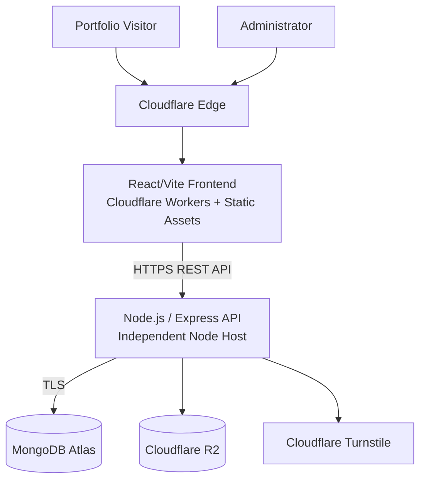

# Software Developer Portfolio — Production Deployment Guide

## 1. Document Purpose

This document defines the production deployment architecture and deployment procedure for the Software Developer Portfolio.

It covers:

- Production architecture
- Deployment prerequisites
- Frontend deployment
- Backend deployment
- MongoDB Atlas
- Cloudflare R2
- Cloudflare Turnstile
- Environment variables
- Authentication configuration
- CORS
- Cookies
- Proxy configuration
- HTTPS
- Security hardening
- Deployment sequence
- Health checks
- Smoke testing
- Monitoring
- Rollback
- Recovery

The portfolio has not yet reached production deployment.

This document therefore represents the approved deployment architecture and planned production process.

---

# 2. Production Architecture

The planned production topology is:



---

# 3. Production Components

Production consists of several independently managed components.

| Component | Technology | Responsibility |
|---|---|---|
| Frontend | React/Vite | User interface |
| Frontend Hosting | Cloudflare Workers + Static Assets | Edge delivery |
| Backend | Node.js/Express | REST API/business logic |
| Database | MongoDB Atlas | Application data |
| Media | Cloudflare R2 | Images/CV/media |
| Bot Protection | Cloudflare Turnstile | Contact abuse reduction |
| Repository | GitHub | Source control |
| CI/CD | GitHub Actions planned | Automated validation/deployment |

---

# 4. Deployment Philosophy

Production deployment should follow:

```text id="p1qkxm"
Build
   ↓
Test
   ↓
Security validation
   ↓
Deploy
   ↓
Smoke test
   ↓
Monitor
```

Deployment should not be used as the primary testing environment.

---

# 5. Environment Separation

The project distinguishes:

```text id="71uc22"
Development
Test
Production
```

These environments should not share sensitive resources unnecessarily.

Examples:

```text id="sbdgv8"
Development database ≠ Production database

Test database ≠ Production database

Development credentials ≠ Production credentials
```

---

# 6. Production Branch

Production deployment should normally originate from:

```text id="q0odwv"
main
```

Development integration occurs primarily through:

```text id="nh40wh"
develop
```

Feature work may occur on focused branches.

---

# 7. Production Deployment Prerequisites

Before first production deployment:

```text id="e5mw6p"
[ ] Application functionality complete for release
[ ] Frontend lint passes
[ ] Frontend build passes
[ ] Backend tests pass
[ ] Authentication tested
[ ] Authorization tested
[ ] Draft protection tested
[ ] Security regression tests pass
[ ] Production environment variables prepared
[ ] MongoDB production configuration prepared
[ ] R2 prepared
[ ] Turnstile prepared
[ ] Cloudflare frontend deployment prepared
[ ] Backend host prepared
[ ] HTTPS available
[ ] Rollback approach understood
```

---

# 8. Production Frontend

The production frontend target is:

```text id="5uc98q"
Cloudflare Workers with Static Assets
```

The frontend application remains:

```text id="plf9wk"
React
Vite
Tailwind CSS
React Router
```

---

# 9. Production Frontend Build

From:

```text id="4d7ojr"
client/
```

run:

```powershell id="mjm2i1"
npm run lint
npm run build
```

Both must succeed before production deployment.

---

# 10. Frontend Production Configuration

Production requires:

```env id="04vq5n"
VITE_API_BASE_URL=https://<production-api-host>/api/v1
```

Potential future public configuration:

```env id="vdm4aw"
VITE_TURNSTILE_SITE_KEY=
```

These variables are browser-visible and must contain no secrets.

---

# 11. Frontend Secrets

The frontend must never contain:

```text id="ksnpzd"
MONGODB_URI
SESSION_SECRET
R2_SECRET_ACCESS_KEY
TURNSTILE_SECRET_KEY
Deployment tokens
Private API credentials
```

Anything embedded in the frontend bundle should be assumed publicly readable.

---

# 12. Frontend Routing

Production deployment must support direct navigation to React Router routes such as:

```text id="0wzuvm"
/
/projects
/projects/:slug
/about
/skills
/contact
/admin/*
```

Cloudflare static-asset routing must correctly fall back to the SPA where required.

---

# 13. Production Backend

The backend remains an independent:

```text id="gibq38"
Node.js / Express
```

application.

The backend hosting provider has not yet been finalized.

---

# 14. Backend Host Requirements

The selected production host must support:

```text id="i0mgbq"
Node.js >= 22
HTTPS
Environment secrets
Persistent service operation
MongoDB Atlas connectivity
Outbound HTTPS
Logging
Health checks
Reverse proxy support
Graceful deployment/restart
```

---

# 15. Backend Build Requirements

The backend currently uses JavaScript ES modules and does not require a compilation build step.

Production startup is expected to use:

```powershell id="2ev32m"
npm start
```

which executes:

```text id="zfv0tz"
node server.js
```

---

# 16. Backend Production Environment

Production configuration may include:

```env id="c8wp22"
NODE_ENV=production
PORT=

MONGODB_URI=
SESSION_SECRET=

CLIENT_URLS=

R2_ACCOUNT_ID=
R2_ACCESS_KEY_ID=
R2_SECRET_ACCESS_KEY=
R2_BUCKET_NAME=

TURNSTILE_SECRET_KEY=
```

The exact authentication secret variable may change when authentication architecture is finalized.

---

# 17. `NODE_ENV`

Production shall use:

```env id="ih1owq"
NODE_ENV=production
```

Production behavior may depend on this setting for:

- Error responses
- Cookie security
- Logging
- Security behavior

---

# 18. Production Port

The backend should support a host-provided:

```env id="g1h9fb"
PORT=
```

The application should not assume production always uses:

```text id="3s3u7k"
5000
```

Internally.

---

# 19. MongoDB Atlas Production Database

MongoDB Atlas is the production database platform.

The production backend connects through:

```env id="0p4krq"
MONGODB_URI=
```

---

# 20. Production Database User

Create a dedicated application database user.

The application should not use a general Atlas administrative account.

Permissions should follow least privilege.

---

# 21. Database Credentials

Use:

- Strong generated password
- Dedicated application user
- Server-side secret storage

Do not place credentials in:

```text id="trkhb6"
Git
Frontend
README
Documentation
Screenshots
Logs
```

---

# 22. MongoDB Network Access

Production network access should reflect the selected backend host.

Restrict database exposure as much as the infrastructure reasonably permits.

Avoid treating:

```text id="xjs55v"
0.0.0.0/0
```

as the default production configuration.

---

# 23. MongoDB TLS

Production MongoDB connections should use encrypted transport provided by the supported Atlas connection architecture.

Do not intentionally downgrade production database transport security.

---

# 24. MongoDB Connection Startup

Target startup sequence:

```text id="zk93no"
Load environment
      ↓
Validate environment
      ↓
Connect MongoDB
      ↓
Start HTTP listener
```

The API should not report itself ready before required infrastructure is available.

---

# 25. Database Failure

If MongoDB cannot connect during startup:

```text id="etb2c4"
Application startup
       ↓
Database connection fails
       ↓
Log controlled error
       ↓
Do not start falsely healthy API
```

The hosting environment may then restart/retry according to its service policy.

---

# 26. Cloudflare R2 Production

Production media storage uses:

```text id="c9w7d0"
Cloudflare R2
```

Potential content:

```text id="wawtpu"
Project covers
Project screenshots
Gallery images
CV
Portfolio media
```

---

# 27. Production R2 Credentials

The backend requires secure access configuration such as:

```env id="5oif3f"
R2_ACCOUNT_ID=
R2_ACCESS_KEY_ID=
R2_SECRET_ACCESS_KEY=
R2_BUCKET_NAME=
```

These credentials belong only in the backend production environment.

---

# 28. R2 Least Privilege

Production R2 credentials should be restricted to the required:

- Bucket
- Object operations

Avoid unnecessary account-wide administrative permissions.

---

# 29. R2 Upload Architecture

Preferred production flow:

```text id="oaq5rh"
Authenticated admin
       ↓
Express API
       ↓
Validate request
       ↓
Generate controlled object key
       ↓
Generate temporary upload authorization
       ↓
Browser uploads directly to R2
       ↓
Backend confirms/stores metadata
```

---

# 30. R2 Production CORS

R2 browser upload configuration should permit only required trusted origins.

Production origin should correspond to the actual portfolio/admin frontend.

Development origins should not remain in production configuration unless genuinely required.

---

# 31. R2 Public Media

Portfolio images may intentionally be publicly readable.

Public read access must not imply:

```text id="50o7t4"
Public write
Public delete
Public bucket administration
```

Write operations remain protected.

---

# 32. Cloudflare Turnstile Production

The contact form will use:

```text id="uz5c88"
Cloudflare Turnstile
```

The production configuration consists of:

```text id="hdcr20"
Public site key
Private secret key
```

---

# 33. Turnstile Site Key

The public site key may be provided to the frontend.

Example:

```env id="ewb6tb"
VITE_TURNSTILE_SITE_KEY=
```

This is not a secret.

---

# 34. Turnstile Secret

The private secret belongs only to the backend:

```env id="zktft1"
TURNSTILE_SECRET_KEY=
```

It must not be exposed through frontend code.

---

# 35. Turnstile Hostname Configuration

When a production domain is introduced, Turnstile configuration should be reviewed so expected production hostnames are allowed.

Temporary development/deployment hostnames should not remain indefinitely without reason.

---

# 36. Production CORS

The backend production allowlist shall contain explicit trusted frontend origins.

Example:

```env id="ymu7c2"
CLIENT_URLS=https://example.com,https://www.example.com
```

Only include origins that genuinely need browser API access.

---

# 37. Development Origin Removal

Production configuration should not automatically contain:

```text id="f8du9c"
http://localhost:5173
```

unless there is a deliberate operational reason.

Development and production configuration should remain separate.

---

# 38. Credentialed CORS

Because administrative authentication uses cookies:

```text id="y37yde"
credentials: true
```

may be required.

Do not use:

```text id="9q1f4p"
Access-Control-Allow-Origin: *
```

with credentialed authentication.

---

# 39. Authentication Cookies

Production authentication cookies should use appropriate attributes including:

```text id="ls7ax4"
HttpOnly
Secure
SameSite
Path
Expiration
```

The exact policy depends on the final domain architecture.

---

# 40. `HttpOnly`

Authentication cookies should be:

```text id="f57x4d"
HttpOnly
```

to reduce direct JavaScript access.

---

# 41. `Secure`

Production authentication cookies shall use:

```text id="pf70jn"
Secure
```

because production uses HTTPS.

---

# 42. `SameSite`

The final:

```text id="cym4vf"
SameSite
```

value depends on whether frontend and API are same-site or cross-site under the deployed topology.

It must be tested using the real production domains.

---

# 43. Cookie Domain

Do not set a broad cookie:

```text id="31yykz"
Domain
```

unless required.

Host-only cookies are generally preferable when cross-subdomain sharing is unnecessary.

---

# 44. Cookie Expiration

Authentication state must have a defined expiration.

Production authentication should not create effectively permanent sessions unintentionally.

---

# 45. CSRF

Because authentication uses cookies, production deployment must verify the selected CSRF protections.

Possible controls include:

```text id="r4xltx"
SameSite cookies
Origin validation
CSRF token
```

depending on the final architecture.

---

# 46. HTTPS

Production frontend and backend shall use HTTPS.

Expected:

```text id="tf01pe"
https://portfolio.example.com
https://api.example.com
```

or equivalent production hostnames.

---

# 47. HTTP Redirects

If HTTP is reachable publicly, it should redirect to HTTPS where supported.

Sensitive credentials must not be transmitted over plaintext HTTP.

---

# 48. Mixed Content

Production frontend code must not request:

```text id="2z2ywi"
http://api...
```

from an HTTPS page.

All production API and media URLs should use secure transport.

---

# 49. Reverse Proxy

Most Node.js production hosts place Express behind a reverse proxy.

This affects:

- Client IP detection
- Secure cookies
- Rate limiting
- Protocol detection
- Logging

---

# 50. Express `trust proxy`

`trust proxy` must be configured according to the actual hosting architecture.

Do not blindly use:

```javascript id="n67mwm"
app.set('trust proxy', true)
```

without understanding the proxy chain.

---

# 51. Forwarded Headers

Headers such as:

```text id="tbqk75"
X-Forwarded-For
X-Forwarded-Proto
```

should only be trusted according to the known proxy architecture.

Incorrect trust configuration can weaken IP-based security controls.

---

# 52. Rate Limiting Behind Proxy

Production rate limiting must be tested after deployment.

Verify that:

```text id="51qfq5"
Different clients
```

are not incorrectly treated as one IP and that spoofed forwarding headers cannot trivially bypass rate limits.

---

# 53. Production Error Handling

Production responses should hide unexpected internal details.

Expected:

```json id="l8i6yb"
{
  "success": false,
  "message": "Internal server error"
}
```

Unexpected stack traces must not be returned publicly.

---

# 54. Production Logging

Server logs should capture useful operational information without logging:

```text id="5mhrr3"
Passwords
Authentication cookies
Tokens
MongoDB URI
R2 secret
Turnstile secret
Deployment credentials
```

---

# 55. Audit Logging

Production administrative operations should create audit events.

Important events include:

```text id="wmvr2h"
Authentication success/failure
Logout
Project creation
Project updates
Publication changes
Project deletion
Media operations
Settings changes
CV replacement
```

---

# 56. Security Headers

Production responses should use the approved security-header configuration.

Express uses:

```text id="96i2fv"
Helmet
```

as a baseline.

The deployed application must verify the headers actually received by browsers after all proxies/CDNs.

---

# 57. Content Security Policy

Production CSP should be based on actual application resources.

Expected sources may include:

```text id="1bd61u"
Application origin
API origin
R2/media origin
Turnstile
Required fonts/resources
```

Do not introduce