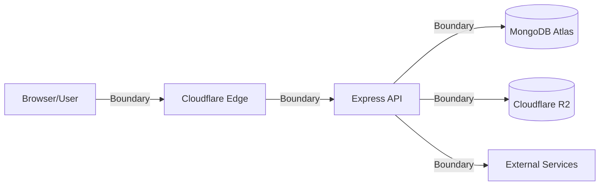
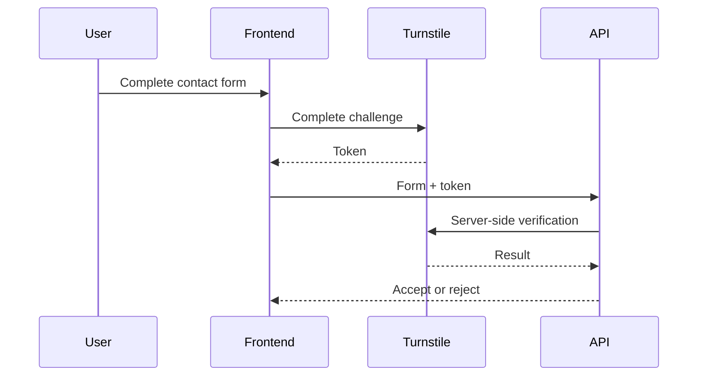

# Software Developer Portfolio — Security Architecture

## 1. Document Purpose

This document defines the security requirements, controls, implementation principles, and review expectations for the Software Developer Portfolio.

Security is treated as part of the application architecture rather than as a final deployment step.

This document covers:

- Authentication
- Authorization
- Password security
- Cookies and authentication state
- CORS
- CSRF
- XSS
- Content Security Policy
- NoSQL injection
- Input validation
- Rate limiting
- File uploads
- Cloudflare R2
- Cloudflare Turnstile
- Secret management
- Error handling
- Logging
- Audit logging
- Dependency security
- Database security
- Deployment security
- CI/CD security
- Security testing

Detailed threat analysis is maintained separately in:

```text
docs/threat-model.md
```

---

# 2. Security Objectives

The security architecture shall protect:

1. Administrator credentials
2. Administrator authentication state
3. Administrative functionality
4. Draft/unpublished project content
5. Portfolio content integrity
6. Contact enquiries
7. MongoDB data
8. Cloudflare R2 media
9. Infrastructure credentials
10. Deployment credentials
11. Audit information
12. Application availability

The system should reduce both accidental exposure and deliberate abuse.

---

# 3. Security Principles

The application follows these principles:

```text
Never trust client input
Least privilege
Defense in depth
Secure by default
Explicit authorization
Data minimization
Fail safely
Keep secrets server-side
Validate at trust boundaries
Log security-relevant activity
Minimize attack surface
```

---

# 4. Trust Model

The browser is an untrusted environment.

Anything supplied by the browser must be treated as untrusted, including:

- Request bodies
- Query parameters
- Route parameters
- Headers
- Cookies
- Uploaded metadata
- Filenames
- URLs
- Contact messages

Conceptually:

```text
Browser
   ↓
UNTRUSTED
   ↓
Validation
   ↓
Authentication
   ↓
Authorization
   ↓
Business logic
   ↓
Database / infrastructure
```

---

# 5. Security Boundaries

Major trust boundaries include:



Security controls must be applied whenever data crosses these boundaries.

---

# 6. Authentication

Administrative functionality requires authentication.

The public portfolio does not require authentication.

There shall be no public administrator registration.

The planned authentication endpoints are:

```text
POST /api/v1/auth/login
POST /api/v1/auth/logout
GET  /api/v1/auth/me
```

A public route such as:

```text
POST /api/v1/auth/register
```

shall not exist.

---

# 7. Administrator Provisioning

The initial administrator shall be created through a controlled bootstrap process.

Administrator creation must not depend on a public browser registration form.

Bootstrap credentials must not be:

- Hardcoded
- Committed to Git
- Stored in documentation
- Logged
- Included in frontend code

Once administrator creation is complete, temporary bootstrap credentials or mechanisms should be removed or disabled where appropriate.

---

# 8. Password Hashing

Administrator passwords shall be hashed using:

```text
Argon2id
```

Plaintext passwords shall never be stored.

Conceptually:

```text
Password
   ↓
Argon2id
   ↓
Password hash
   ↓
MongoDB
```

Authentication:

```text
Submitted password
       ↓
Argon2id verification
       ↓
Stored hash
       ↓
Match?
```

---

# 9. Password Hash Configuration

Argon2id parameters shall use secure values appropriate to the production environment.

Parameters should not be chosen merely for speed.

The implementation should balance:

- Memory cost
- Time cost
- Parallelism
- Server resources
- Authentication performance

Parameters shall be documented when authentication is implemented.

---

# 10. Password Handling

Plaintext passwords must never appear in:

- Application logs
- Audit logs
- Error responses
- Database records
- Analytics
- Debug output
- Git history

Password variables should exist in memory only as long as required to perform authentication or password creation.

---

# 11. Login Security

The login endpoint shall include:

- Strict request validation
- Dedicated rate limiting
- Generic credential failure responses
- Secure password verification
- Account active-state verification
- Audit logging
- Secure authentication state creation

Login failures should not unnecessarily disclose whether an email address exists.

Preferred failure message:

```text
Invalid email or password
```

---

# 12. Brute-Force Protection

The login endpoint requires stricter protection than the general API.

Controls may include:

- Dedicated login rate limiting
- Temporary throttling
- Security logging
- Cloudflare edge protections

Permanent account lockouts should not be introduced without considering denial-of-service abuse against the administrator account.

---

# 13. Authentication State

Browser authentication shall use secure HTTP-only cookies.

Authentication credentials shall not be stored in:

```text
localStorage
```

or:

```text
sessionStorage
```

when those values would allow direct JavaScript access to bearer authentication credentials.

---

# 14. Cookie Security

Production authentication cookies shall use appropriate attributes.

Expected baseline:

```text
HttpOnly
Secure
SameSite
Path
Expiration
```

### HttpOnly

Prevents normal frontend JavaScript from reading the cookie.

### Secure

Ensures the cookie is transmitted only over HTTPS.

### SameSite

Helps control cross-site cookie behavior and contributes to CSRF protection.

The exact setting depends on production frontend/API topology.

---

# 15. Authentication Expiration

Authentication shall not remain valid indefinitely.

The final implementation shall define:

- Session/token lifetime
- Expiration
- Logout behavior
- Renewal behavior if required
- Password-change invalidation where appropriate

---

# 16. Logout

Logout shall invalidate the current authentication state.

At minimum:

```text
Authentication cookie
       ↓
Invalidated/cleared
```

If server-side session state is introduced, that state must also be invalidated.

---

# 17. Authorization

Authentication does not automatically grant permission to every operation.

Protected routes shall enforce authorization server-side.

Conceptually:

```text
Request
   ↓
Authenticated?
   ↓
Authorized?
   ↓
Controller
```

Frontend controls are not authoritative security controls.

---

# 18. Frontend Route Protection

The frontend may prevent unauthenticated users from navigating normally to administrative pages.

However:

```text
React route guard ≠ authorization
```

A malicious client can bypass frontend routing and call APIs directly.

Therefore, every protected backend operation must enforce authorization independently.

---

# 19. Publication Authorization

Draft projects are protected content.

Public endpoints shall enforce:

```text
status = published
```

A visitor must not retrieve drafts by:

- Guessing MongoDB IDs
- Guessing slugs
- Modifying query parameters
- Calling administrative endpoints directly

---

# 20. CORS

Cross-Origin Resource Sharing shall use an explicit allowlist.

Configuration example:

```env
CLIENT_URLS=http://localhost:5173,https://portfolio.example.com
```

The server parses this into trusted origins.

---

# 21. Credentialed CORS

Because browser authentication uses cookies:

```text
credentials: true
```

may be required.

Credentialed CORS must not use:

```text
Access-Control-Allow-Origin: *
```

Trusted origins shall be explicitly validated.

---

# 22. Multiple Frontend Origins

The system supports multiple trusted frontend origins through:

```env
CLIENT_URLS=
```

Potential origins include:

- Local development
- Production portfolio domain
- Approved Cloudflare deployment URL

Preview URLs shall not automatically be trusted using dangerously broad wildcard rules.

---

# 23. CORS Is Not Access Control

CORS primarily affects browser behavior.

It does not replace:

- Authentication
- Authorization
- Input validation
- Network security

Tools such as `curl` can make requests without browser CORS enforcement.

Therefore:

```text
Allowed by CORS
```

does not mean:

```text
Authorized
```

---

# 24. Requests Without Origin

Legitimate non-browser requests may not include an `Origin` header.

The CORS layer may permit these requests.

Protected endpoints still require authentication and authorization.

---

# 25. CSRF

Cookie-based authentication creates a potential Cross-Site Request Forgery consideration.

CSRF controls shall be evaluated based on the final production topology.

Potential controls include:

- `SameSite` cookies
- Origin checking
- CSRF tokens
- Restricting accepted content types where useful

---

# 26. CSRF Protection Principle

The application shall not assume that:

```text
CORS alone prevents CSRF
```

CORS and CSRF address different security concerns.

Any state-changing authenticated endpoint must be evaluated for CSRF.

---

# 27. CSRF-Sensitive Operations

Examples include:

```text
POST   /api/v1/admin/projects
PATCH  /api/v1/admin/projects/:id
DELETE /api/v1/admin/projects/:id

POST   /api/v1/admin/media/*
PATCH  /api/v1/admin/settings
```

The final CSRF design will be established alongside authentication.

---

# 28. Security Headers

The Express backend uses:

```text
Helmet
```

as the baseline HTTP security-header middleware.

Helmet should remain enabled unless a specific header requires deliberate configuration.

---

# 29. Content Security Policy

A Content Security Policy should be configured based on the actual resources used by the application.

Potential controlled sources include:

- Application origin
- API origin
- R2/media delivery origin
- Cloudflare Turnstile
- Required fonts or external resources

The project should avoid an unnecessarily permissive policy such as widespread:

```text
*
```

or unsafe directives without justification.

---

# 30. XSS

Cross-Site Scripting risks exist anywhere untrusted content is rendered.

Potential sources include:

- Contact enquiries
- Project content
- Media captions
- Administrative content

React escapes ordinary text values by default.

This protection should not be bypassed unnecessarily.

---

# 31. Raw HTML

The application should avoid:

```text
dangerouslySetInnerHTML
```

unless there is a clearly justified requirement.

If rich HTML is introduced later:

1. Define permitted markup.
2. Sanitize content.
3. Test malicious payloads.
4. Configure CSP accordingly.
5. Document the rendering model.

---

# 32. Stored XSS

Administrative content is not automatically trustworthy merely because it came from an administrator.

A compromised administrator account could store malicious content.

Therefore, stored content should still follow safe rendering practices.

---

# 33. Contact Message Rendering

Contact enquiries contain public user-generated content.

Admin pages must render contact fields as text.

Messages must not be interpreted as executable HTML.

---

# 34. Request Validation

All untrusted input shall be validated before business logic.

Validation shall cover:

- Type
- Presence
- Length
- Format
- Allowed values
- Arrays
- URLs
- Email addresses
- Object IDs
- Unexpected fields

---

# 35. Validation Location

Validation should occur at the HTTP boundary:

```text
Request
   ↓
Validator
   ↓
Controller
   ↓
Service
```

Mongoose schema validation provides additional defense but is not a replacement for API validation.

---

# 36. Mass Assignment

Request bodies must not be blindly passed into database updates.

Unsafe:

```javascript
Project.findByIdAndUpdate(req.params.id, req.body)
```

when `req.body` is uncontrolled.

Instead:

```text
Request
   ↓
Strict validation
   ↓
Allowed fields
   ↓
Controlled update
```

---

# 37. NoSQL Injection

MongoDB query structures must not be constructed directly from arbitrary client objects.

Unsafe:

```javascript
Project.find(req.query)
```

or:

```javascript
Admin.findOne(req.body)
```

without strict control.

Queries shall be constructed explicitly from validated values.

---

# 38. MongoDB Operators

User-controlled objects must not be allowed to introduce arbitrary MongoDB operators such as:

```text
$ne
$gt
$where
```

where they are not explicitly expected.

Strict validation and controlled query construction are the primary defense.

---

# 39. ObjectId Validation

User-controlled MongoDB identifiers must be validated before use.

Invalid identifiers should generate controlled client errors.

Raw Mongoose cast errors must not leak into production responses.

---

# 40. URL Validation

Project URLs such as:

```text
liveUrl
repositoryUrl
```

must be validated.

Where URLs are later rendered into links, protocols should be restricted to appropriate schemes such as:

```text
https:
```

and possibly:

```text
http:
```

during local/development scenarios where justified.

Unsafe schemes such as:

```text
javascript:
```

must not be accepted.

---

# 41. Request Size Limits

Current baseline normal request limit:

```text
100 KB
```

for JSON and URL-encoded bodies.

This protects against unnecessarily large ordinary API payloads.

The limit may be adjusted when actual content requirements justify it.

---

# 42. Large Media

Large files shall not be embedded as:

- Base64 JSON
- Large ordinary form fields
- Arbitrary API payloads

Media shall use the dedicated R2 upload architecture.

---

# 43. Rate Limiting

The application uses layered rate limiting.

Current baseline:

```text
General API limiter
```

Planned additional limiters:

```text
Login limiter
Contact limiter
Media-operation limiter
```

---

# 44. Rate Limit Design

Rate limits should reflect endpoint risk.

For example:

```text
Health/public browsing
        ↓
Normal API limit

Login
        ↓
Stricter brute-force limit

Contact form
        ↓
Anti-spam limit
```

One universal threshold is not necessarily appropriate.

---

# 45. Rate Limit Storage

The initial implementation may use in-memory rate limiting.

Before scaling the API horizontally across multiple instances, the rate-limit architecture must be reviewed.

Distributed instances may require shared rate-limit state.

This complexity is not currently required.

---

# 46. Contact Form Security

The public contact endpoint requires:

- Input validation
- Length limits
- Email validation
- Request-size limits
- Rate limiting
- Turnstile verification
- Safe storage
- Safe rendering

---

# 47. Cloudflare Turnstile

Cloudflare Turnstile is planned for contact abuse protection.

Flow:



---

# 48. Turnstile Secret

The Turnstile secret key must exist only on the backend.

Example:

```env
TURNSTILE_SECRET_KEY=
```

It must never use a frontend variable such as:

```text
VITE_TURNSTILE_SECRET_KEY
```

because `VITE_` values are browser-visible.

---

# 49. Turnstile Limitations

Turnstile is an abuse-reduction control.

It does not replace:

- Validation
- Rate limiting
- Authorization
- Request-size limits
- Safe storage

Defense in depth remains required.

---

# 50. Media Security

Media management is an administrative capability.

Only authenticated and authorized administrators may request upload authorization or delete assets.

---

# 51. R2 Credential Security

Cloudflare R2 credentials shall remain server-side.

Potential environment variables include:

```env
R2_ACCOUNT_ID=
R2_ACCESS_KEY_ID=
R2_SECRET_ACCESS_KEY=
R2_BUCKET_NAME=
```

Secret keys shall never be exposed through frontend configuration.

---

# 52. R2 Least Privilege

R2 credentials should be scoped to only the required bucket and operations where possible.

The application should not use account-wide administrative credentials when narrower permissions are sufficient.

---

# 53. Upload Authorization

The preferred architecture uses temporary upload authorization where appropriate.

Conceptually:

```text
Admin browser
      ↓
Request upload permission
      ↓
Express authenticates admin
      ↓
Express validates metadata
      ↓
Temporary authorization
      ↓
Browser uploads to R2
```

This avoids exposing permanent R2 credentials.

---

# 54. File Size Validation

Uploads shall have explicit maximum sizes.

Different resource classes may have different limits.

For example:

```text
Project images
CV/PDF
```

do not necessarily require identical limits.

Final values shall be defined during media implementation.

---

# 55. File Type Validation

Allowed file types shall use explicit allowlists.

Possible project image types:

```text
image/webp
image/jpeg
image/png
```

Possible CV type:

```text
application/pdf
```

The exact list will be finalized during implementation.

---

# 56. File Extension Security

Filename extensions alone are not reliable.

For example:

```text
malware.exe
```

can be renamed:

```text
portfolio.webp
```

Therefore, upload security shall not rely only on extension checking.

---

# 57. MIME Type Security

Browser-supplied MIME types are also untrusted.

Where necessary, the application shall verify actual file characteristics rather than trusting only:

```text
Content-Type
```

provided by the client.

---

# 58. Original Filenames

Original filenames shall not directly determine R2 object keys.

The server should generate controlled object keys.

Example:

```text
projects/sign-natural-academy/uuid-cover.webp
```

This reduces risks involving:

- Collisions
- Unsafe characters
- Path manipulation
- Information disclosure

---

# 59. Media Deletion Security

Before deleting an asset:

1. Authenticate.
2. Authorize.
3. Validate media ID.
4. Find media metadata.
5. Check references.
6. Delete R2 object if safe.
7. Delete database metadata.
8. Record audit event.

Assets referenced by projects, settings, or CV configuration should not be deleted accidentally.

---

# 60. Database Security

MongoDB Atlas shall use:

- Dedicated database credentials
- Strong authentication
- Least privilege
- Network access controls
- TLS connections
- Appropriate backup configuration

---

# 61. MongoDB Credentials

The application shall use a dedicated application database user.

It should not use an unnecessarily privileged Atlas administrative account.

---

# 62. MongoDB Network Access

Development access may permit the developer's current trusted IP.

Production access should be restricted according to the backend hosting architecture.

A broad rule such as:

```text
0.0.0.0/0
```

should not be the default production security posture.

If infrastructure constraints temporarily require broader access, additional controls and the reason should be documented.

---

# 63. MongoDB Connection String

The MongoDB URI shall be stored in:

```env
MONGODB_URI=
```

It must not appear in:

- Git
- README examples containing real credentials
- Client code
- Screenshots intended for publication
- Logs

---

# 64. Secrets

Secrets include:

```text
MongoDB credentials
Authentication/session secrets
R2 access keys
Turnstile secret
Deployment tokens
CI/CD secrets
```

Secrets shall be stored using environment or deployment secret-management facilities.

---

# 65. `.env`

Local secrets may be stored in:

```text
server/.env
```

during development.

This file must remain excluded by Git.

A safe:

```text
.env.example
```

shall document variable names without real secret values.

---

# 66. Git Secret Protection

Before commits involving configuration, verify:

```powershell
git status
```

and, where necessary:

```powershell
git check-ignore server/.env
```

Secrets must not be committed even temporarily.

Removing a secret from the latest file does not automatically remove it from Git history.

---

# 67. Secret Rotation

If a secret is accidentally exposed:

1. Treat it as compromised.
2. Revoke or rotate it.
3. Remove it from current source.
4. Assess Git history.
5. Update deployment environments.
6. Investigate potential use.

Simply deleting the visible string is insufficient.

---

# 68. Frontend Environment Variables

All frontend environment variables should be assumed visible to users.

For example:

```env
VITE_API_BASE_URL=
```

is configuration, not a secret.

Never store secret values using a `VITE_` prefix.

---

# 69. Error Handling

The application shall use centralized backend error handling.

Production error responses must avoid exposing:

- Stack traces
- Database internals
- Server paths
- Environment variables
- Credentials
- Internal service configuration

---

# 70. Production Error Example

Preferred:

```json
{
  "success": false,
  "message": "Internal server error"
}
```

Not:

```text
MongoServerError ...
MONGODB_URI ...
C:\Users\...
node_modules\...
```

---

# 71. Development Errors

Development may provide additional diagnostic details.

However, secrets must remain protected in every environment.

Debugging does not justify logging:

- Passwords
- Cookies
- Tokens
- Secret keys

---

# 72. Logging

Operational logging should capture enough information to diagnose failures without recording sensitive values.

Potential events include:

- Startup failures
- Database connection failures
- API errors
- R2 failures
- Turnstile failures
- Authentication failures

---

# 73. Sensitive Logging

The following must not be logged:

```text
Passwords
Password hashes unnecessarily
Session cookies
Authentication tokens
MongoDB URI
R2 secret keys
Turnstile secret
Deployment tokens
```

---

# 74. Audit Logging

Administrative security-relevant actions shall generate audit records.

Examples:

```text
auth.login.success
auth.login.failed
auth.logout
project.created
project.updated
project.published
project.deleted
media.uploaded
media.deleted
settings.updated
cv.replaced
```

---

# 75. Audit Integrity

Audit records should normally be append-oriented.

The ordinary administrative interface should not casually permit audit history modification.

Audit data must itself be access-controlled.

---

# 76. Audit Data Minimization

Audit logs should capture enough information to answer:

```text
Who?
What?
Which resource?
When?
Relevant safe context?
```

without storing sensitive request payloads.

---

# 77. Dependency Security

Third-party dependencies introduce supply-chain risk.

Dependencies shall be:

- Added intentionally
- Maintained
- Reviewed
- Updated when security fixes require it
- Removed when unused

---

# 78. Dependency Installation

Packages should be installed from trusted package registries using the project's package manager.

The project shall commit:

```text
package-lock.json
```

to support reproducible dependency resolution.

---

# 79. Dependency Auditing

Dependency security checks may include:

```powershell
npm audit
```

However, audit findings require interpretation.

Not every advisory has equal practical impact.

Security updates should consider:

- Exploitability
- Production usage
- Dependency path
- Breaking-change risk

---

# 80. Avoid Unnecessary Dependencies

A new dependency should solve a clear problem.

Adding packages unnecessarily:

- Expands attack surface
- Increases maintenance
- Increases supply-chain exposure
- Increases bundle/server complexity

Native platform functionality should be preferred where it is sufficient.

---

# 81. Node.js Version

The project baseline requires:

```text
Node.js >= 22
```

Production and CI environments should use a supported Node.js release compatible with the project.

Runtime versions should not drift silently between development and production.

---

# 82. HTTPS

Production traffic shall use HTTPS.

Sensitive authentication cookies shall use:

```text
Secure
```

in production.

Credentials shall not be transmitted over plaintext HTTP in production.

---

# 83. Cloudflare Edge

Cloudflare may provide edge-level protections including:

- TLS termination
- DDoS protection
- WAF capabilities where configured
- Turnstile
- CDN behavior

These controls supplement application security.

They do not replace secure backend implementation.

---

# 84. Backend Exposure

Even when Cloudflare protects the frontend, the backend may have its own public origin.

Backend security must assume that attackers can call the API directly.

Therefore, the API must independently enforce:

- Authentication
- Authorization
- Validation
- Rate limiting
- Security headers
- Safe errors

---

# 85. Proxy Trust

If the backend is deployed behind a reverse proxy, Express proxy configuration must be deliberate.

Incorrect:

```text
trust proxy
```

configuration can affect:

- Client IP detection
- Secure cookies
- Rate limiting
- Logging

The application must not blindly trust arbitrary forwarding headers.

---

# 86. IP Address Trust

Headers such as:

```text
X-Forwarded-For
```

are not automatically trustworthy.

They should only influence client-IP determination when the application's proxy chain is correctly configured.

---

# 87. Availability Protection

Controls contributing to availability include:

- Request-size limits
- Rate limiting
- Cloudflare protection
- Database connection management
- Controlled uploads
- Timeouts where appropriate
- Graceful shutdown
- Error isolation

---

# 88. Resource Exhaustion

The application should avoid operations that allow clients to request unbounded resources.

Examples:

```text
Unlimited project result sets
Unlimited media listing
Unbounded request bodies
Unrestricted file sizes
Expensive uncontrolled MongoDB queries
```

Pagination and limits shall be applied.

---

# 89. Pagination Security

Pagination parameters shall have maximum values.

Example concept:

```text
limit <= server-defined maximum
```

A client should not be able to request:

```text
limit=100000000
```

and force an unnecessarily expensive database response.

---

# 90. Search and Regex Security

If project search is introduced later, arbitrary client-controlled regular expressions should not be passed directly into MongoDB.

Search input must be validated and escaped/controlled appropriately to prevent expensive or malicious queries.

---

# 91. HTTP Methods

Endpoints shall use intended HTTP methods.

State-changing operations should not use `GET`.

Examples:

```text
GET    → retrieve
POST   → create/action
PATCH  → partial update
DELETE → delete
```

---

# 92. Administrative Destructive Actions

Destructive operations should require explicit administrative intent.

Examples:

- Project deletion
- Media deletion
- CV replacement
- Settings modification

The frontend may provide confirmation UX, but backend authorization remains mandatory.

---

# 93. Security of Public IDs

MongoDB ObjectIds are not authentication secrets.

Security shall not rely on an attacker being unable to guess or discover an identifier.

Every protected resource must remain protected even when its identifier is known.

---

# 94. Security of Slugs

Project slugs are intentionally public.

They provide usability and SEO, not access control.

Publication state must be enforced independently.

---

# 95. Contact Privacy

Contact enquiries may contain personal information voluntarily provided by visitors.

The application should:

- Limit access to authenticated administration
- Avoid exposing enquiries through public APIs
- Retain only useful data
- Delete/archive data when no longer required
- Avoid unnecessary logging of message content

---

# 96. Admin Dashboard Security

The admin dashboard shall:

- Require authenticated API access
- Avoid exposing secrets
- Render untrusted contact content safely
- Handle authentication expiration
- Avoid caching sensitive data unnecessarily
- Prevent unauthorized actions even if frontend controls are manipulated

---

# 97. Browser Cache Considerations

Sensitive admin API responses should be evaluated for appropriate cache behavior.

Public portfolio content may benefit from caching.

Administrative/authentication responses should not be cached in ways that expose sensitive information.

---

# 98. R2 Public Delivery

Public portfolio images may require public delivery through an approved hostname or controlled delivery architecture.

Public readability of portfolio images does not imply administrative write permission.

Read and write privileges must remain distinct.

---

# 99. CV Security

The public CV may be intentionally downloadable.

Administrative CV replacement remains protected.

Only approved document formats should be accepted.

A replaced CV should not allow arbitrary executable content to become trusted application content.

---

# 100. CI/CD Security

Future CI/CD pipelines shall use protected repository/deployment secrets.

Secrets shall not be written directly into workflow files.

CI/CD permissions should follow least privilege.

---

# 101. GitHub Workflow Security

Workflow permissions should be explicitly constrained where appropriate.

Third-party GitHub Actions should be selected carefully.

Production deployment credentials should only be available to jobs that require them.

---

# 102. Security Checks in CI

Future CI may include:

```text
Linting
Automated tests
Dependency audit
Production build
Security-focused tests
```

A failed critical security check should prevent production deployment once enforcement is established.

---

# 103. Production Configuration

Production configuration shall not simply copy development settings.

Production requires review of:

- `NODE_ENV`
- CORS origins
- Cookie settings
- MongoDB access
- R2 credentials
- Turnstile
- HTTPS
- Proxy trust
- Logging
- Error exposure
- Rate limits
- Deployment secrets

---

# 104. Development Configuration

Development may use:

```text
http://localhost:5173
http://localhost:5000
```

and less restrictive diagnostic errors.

Development convenience must not silently become production configuration.

---

# 105. Security Testing

Security testing shall include expected failure cases.

Examples:

### Authentication

- Wrong password
- Unknown email
- Missing authentication cookie
- Expired authentication state
- Disabled administrator

### Authorization

- Public request to admin endpoint
- Invalid role where roles exist

### Projects

- Public draft retrieval attempt
- Invalid ObjectId
- Duplicate slug
- Unexpected fields

### Input

- Oversized request
- Invalid URL
- MongoDB operator payload
- Malformed JSON

### Contact

- Missing fields
- Oversized message
- Invalid email
- Invalid Turnstile token
- Repeated submissions

### Media

- Unsupported type
- Oversized file
- Unauthorized upload
- Unauthorized deletion
- Delete referenced media

---

# 106. Example NoSQL Injection Test

An authentication request should reject malicious structures such as:

```json
{
  "email": {
    "$ne": null
  },
  "password": "test"
}
```

The validator should require:

```text
email = string
```

before authentication logic executes.

---

# 107. Example Mass Assignment Test

A project update containing:

```json
{
  "title": "Updated Project",
  "createdBy": "ATTACKER_CONTROLLED_VALUE"
}
```

must not permit modification of protected fields simply