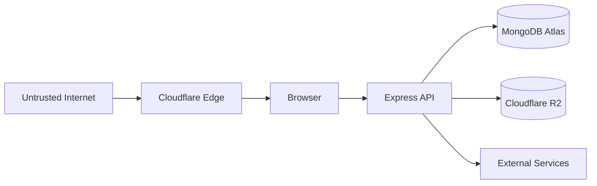

# Software Developer Portfolio — Threat Model

## 1. Document Purpose

This document defines the threat model for the Software Developer Portfolio.

It identifies:

- Security-sensitive assets
- Potential threat actors
- Entry points
- Trust boundaries
- Attack surfaces
- Threat scenarios
- STRIDE threats
- Existing and planned mitigations
- Residual risks
- Security assumptions
- Review triggers

This document complements:

```text
docs/security.md
```

`security.md` defines the security controls.

`threat-model.md` identifies the threats those controls are intended to address.

---

# 2. Scope

The threat model covers the planned production architecture:

```text
Public Internet
      ↓
Cloudflare
      ↓
React/Vite frontend
      ↓
Node.js/Express API
      ↓
MongoDB Atlas
      ↓
Cloudflare R2
```

It also covers supporting systems such as:

- GitHub
- CI/CD
- Cloudflare Turnstile
- Backend hosting
- Administrator browser
- Development environment

---

# 3. Primary Security Objectives

The threat model aims to preserve:

## Confidentiality

Prevent unauthorized access to:

- Administrator credentials
- Authentication state
- Contact enquiries
- Draft projects
- Infrastructure credentials
- Deployment secrets
- Database credentials
- R2 credentials

## Integrity

Prevent unauthorized modification of:

- Projects
- Categories
- Portfolio settings
- CV
- Media
- Administrative accounts
- Audit records

## Availability

Protect the portfolio and API against:

- Request flooding
- Resource exhaustion
- Oversized payloads
- Upload abuse
- Database exhaustion
- Application crashes

---

# 4. Important Assets

The primary assets requiring protection are:

| Asset | Confidentiality | Integrity | Availability |
|---|---|---|---|
| Admin password | Critical | Critical | Medium |
| Authentication state | Critical | Critical | Medium |
| Projects | Low/Medium | High | High |
| Draft projects | Medium | High | Medium |
| Contact enquiries | High | High | Medium |
| Portfolio settings | Low | High | High |
| CV | Low | High | High |
| Media assets | Low | High | High |
| MongoDB credentials | Critical | Critical | Critical |
| R2 credentials | Critical | Critical | High |
| Authentication secrets | Critical | Critical | Critical |
| Turnstile secret | High | High | Medium |
| Deployment credentials | Critical | Critical | Critical |
| Audit logs | Medium | High | Medium |
| Source repository | Medium | Critical | High |

---

# 5. Threat Actors

Potential threat actors include:

## 5.1 Opportunistic Internet Attackers

Automated scanners and attackers searching for:

- Exposed admin panels
- Vulnerable APIs
- Default credentials
- Known dependency vulnerabilities
- Misconfigured cloud services
- Exposed secrets

---

## 5.2 Bots

Automated systems may attempt:

- Contact spam
- Credential stuffing
- Brute-force login
- Content scraping
- Resource exhaustion
- Automated vulnerability scanning

---

## 5.3 Malicious Visitors

A visitor may deliberately send:

- XSS payloads
- NoSQL injection payloads
- Oversized requests
- Invalid identifiers
- Malicious URLs
- Repeated requests
- Unexpected object structures

---

## 5.4 Compromised Administrator Browser

An attacker who compromises the administrator's browser or device may attempt to:

- Steal authentication state
- Modify portfolio content
- Upload malicious content
- Delete projects
- Replace the CV
- Access enquiries

---

## 5.5 Compromised Administrator Credentials

An attacker obtaining the administrator password may attempt full administrative access.

Controls must therefore reduce the impact of:

- Password guessing
- Credential stuffing
- Password disclosure

---

## 5.6 Supply-Chain Attacker

A compromised dependency, build package, GitHub Action, or development tool could affect:

- Source code
- Build output
- Deployment
- Secrets
- Production behavior

---

## 5.7 Cloud Credential Attacker

An attacker obtaining:

- MongoDB credentials
- R2 credentials
- Cloudflare credentials
- Deployment tokens

could potentially bypass normal application controls.

Infrastructure credentials therefore require stronger protection than ordinary application data.

---

# 6. External Entry Points

The primary externally reachable entry points are expected to include:

```text
Public frontend
Public REST API
Contact form
Admin login
Media delivery
Cloudflare edge
```

Potential future administrative API endpoints also form part of the attack surface.

---

# 7. Administrative Entry Points

Administrative attack surfaces include:

```text
/admin/login
/admin/*
/api/v1/auth/*
/api/v1/admin/*
```

The URL itself is not considered secret.

Security must not rely on attackers being unaware of administrative routes.

---

# 8. Infrastructure Entry Points

Infrastructure attack surfaces include:

- Backend hosting endpoint
- MongoDB Atlas network endpoint
- Cloudflare R2 APIs
- GitHub repository
- CI/CD workflows
- Cloudflare management environment
- Deployment provider management environment

---

# 9. Trust Boundaries

The architecture contains several trust boundaries.



Each transition requires explicit security assumptions.

---

# 10. Browser Trust Boundary

The backend shall assume that the browser can be manipulated.

An attacker can:

- Modify JavaScript
- Bypass React controls
- Change request bodies
- Change query parameters
- Change headers
- Call API endpoints directly
- Send requests without using the portfolio frontend

Therefore:

```text
Frontend controls are not security boundaries.
```

---

# 11. API Trust Boundary

The Express API is the primary application security boundary.

It must enforce:

- Validation
- Authentication
- Authorization
- Publication rules
- Rate limiting
- Business rules
- Safe database access

---

# 12. Database Trust Boundary

MongoDB is accessible only through trusted backend infrastructure.

React shall never connect directly to MongoDB.

Database credentials must remain server-side.

---

# 13. R2 Trust Boundary

Cloudflare R2 contains portfolio media.

Permanent write credentials must remain outside the browser.

The browser may receive temporary, narrowly scoped upload authorization where appropriate.

---

# 14. STRIDE Model

The project uses STRIDE as one framework for analyzing threats.

STRIDE represents:

```text
S — Spoofing
T — Tampering
R — Repudiation
I — Information Disclosure
D — Denial of Service
E — Elevation of Privilege
```

---

# 15. Spoofing Threats

Spoofing involves pretending to be another identity.

Primary example:

```text
Attacker
   ↓
Pretends to be administrator
   ↓
Administrative API
```

Possible techniques:

- Password guessing
- Credential stuffing
- Stolen cookies
- Stolen authentication tokens
- Session theft

---

# 16. Spoofing Mitigations

Controls include:

- Argon2id password hashing
- Strong administrator password
- Login rate limiting
- HTTP-only authentication cookies
- HTTPS
- Secure cookie configuration
- Authentication expiration
- Logout
- Audit logging

Future stronger authentication controls may be considered if risk warrants them.

---

# 17. Tampering Threats

Tampering involves unauthorized modification of data.

Potential targets:

- Projects
- Categories
- Settings
- CV
- Media
- Contact statuses
- Authentication data
- Audit records

Example:

```text
Unauthenticated attacker
        ↓
PATCH /api/v1/admin/projects/:id
        ↓
Attempts to modify portfolio
```

---

# 18. Tampering Mitigations

Controls include:

- Authentication
- Authorization
- Strict validation
- Field allowlists
- Audit logging
- Protected administrative APIs
- R2 write credential protection
- MongoDB access controls

---

# 19. Repudiation Threats

Repudiation occurs when an actor performs an action and later denies performing it.

Relevant administrative operations include:

- Project deletion
- Publication changes
- Media deletion
- Settings updates
- CV replacement

---

# 20. Repudiation Mitigations

Administrative audit events shall record appropriate information such as:

```text
actor
action
resource
timestamp
safe contextual metadata
```

Audit logs should remain protected against casual modification.

---

# 21. Information Disclosure Threats

Potential information disclosure includes:

- Password hashes
- Authentication cookies
- Draft projects
- Contact enquiries
- MongoDB credentials
- R2 credentials
- Stack traces
- Environment variables
- Internal server paths

---

# 22. Information Disclosure Mitigations

Controls include:

- Environment secret storage
- `.gitignore`
- HTTP-only cookies
- Safe production errors
- Explicit API projections
- Protected admin endpoints
- Publication filtering
- HTTPS
- Database access restrictions
- R2 credential isolation

---

# 23. Denial-of-Service Threats

Potential denial-of-service techniques include:

- Request flooding
- Large JSON payloads
- Contact spam
- Login flooding
- Large uploads
- Expensive database queries
- Excessive pagination limits
- Repeated media operations

---

# 24. Denial-of-Service Mitigations

Controls include:

- Cloudflare edge protection
- Express rate limiting
- Request-size limits
- Pagination limits
- Upload-size limits
- Query restrictions
- Turnstile
- Controlled database queries

---

# 25. Elevation-of-Privilege Threats

An attacker may attempt to gain administrative privileges through:

- Authentication bypass
- Authorization bugs
- Mass assignment
- Manipulated role fields
- Stolen authentication state
- Insecure administrator bootstrap

---

# 26. Elevation-of-Privilege Mitigations

Controls include:

- No public admin registration
- Backend authorization
- Strict validation
- Protected fields
- Controlled administrator bootstrap
- Authentication middleware
- Audit logging

---

# 27. Threat Scenario — Admin Brute Force

Attack:

```text
Attacker
   ↓
Repeated login attempts
   ↓
POST /api/v1/auth/login
```

Potential impact:

```text
Administrator account compromise
```

Mitigations:

- Strong password
- Argon2id
- Dedicated login rate limiter
- Generic failure responses
- Audit logging
- Cloudflare protections

Residual risk:

A valid password obtained through another breach may still succeed.

Credential hygiene remains important.

---

# 28. Threat Scenario — Credential Stuffing

Attackers may test email/password combinations leaked from unrelated services.

Mitigations:

- Unique administrator password
- Rate limiting
- Argon2id
- Security logging

Future stronger authentication may be considered if the threat profile increases.

---

# 29. Threat Scenario — Account Enumeration

An attacker attempts to determine whether an administrator email exists.

Unsafe responses:

```text
Email does not exist
```

versus:

```text
Password incorrect
```

could reveal account existence.

Preferred response:

```text
Invalid email or password
```

---

# 30. Threat Scenario — Stolen Authentication Cookie

If an authentication cookie is stolen, an attacker may impersonate the administrator.

Mitigations include:

- HTTPS
- `HttpOnly`
- `Secure`
- Appropriate `SameSite`
- Expiration
- XSS prevention
- Logout/session invalidation

Residual risk remains if the administrator's device itself is compromised.

---

# 31. Threat Scenario — CSRF

Attack:

```text
Administrator logged in
       ↓
Visits malicious website
       ↓
Malicious site attempts authenticated request
       ↓
Portfolio API
```

Potential impact:

- Project modification
- Settings modification
- Content deletion

Mitigations may include:

- SameSite cookies
- Origin validation
- CSRF token where required
- Appropriate CORS configuration

The final strategy depends on production topology.

---

# 32. Threat Scenario — Stored XSS Through Project Content

Attack:

```text
Malicious content stored in project
       ↓
Frontend renders unsafe HTML
       ↓
Script executes
```

Mitigations:

- React escaping
- Avoid raw HTML
- Validation
- Sanitization if rich HTML becomes necessary
- CSP

---

# 33. Threat Scenario — Stored XSS Through Contact Form

Attack:

```text
Visitor submits:
<script>...</script>
       ↓
Stored as enquiry
       ↓
Admin dashboard renders message
```

If rendered unsafely, the administrator could be attacked.

Mitigation:

Contact messages shall be rendered as text, not executable HTML.

---

# 34. Threat Scenario — Malicious URL

An attacker or compromised administrator attempts to store:

```text
javascript:...
```

as a project URL.

Potential impact:

A visitor clicking the project link could execute malicious behavior.

Mitigations:

- URL validation
- Protocol allowlist
- Safe rendering

---

# 35. Threat Scenario — NoSQL Injection

Example malicious login request:

```json
{
  "email": {
    "$ne": null
  },
  "password": {
    "$ne": null
  }
}
```

If passed directly into MongoDB, this could alter query behavior.

Mitigations:

- Require strings
- Strict validators
- Controlled query construction
- Never use arbitrary request objects as MongoDB filters

---

# 36. Threat Scenario — Mass Assignment

Attack:

```json
{
  "title": "Updated Project",
  "status": "published",
  "createdBy": "attacker-controlled-id"
}
```

If the backend blindly accepts the object, protected fields could be changed.

Mitigations:

- Strict request schemas
- Field allowlists
- Service-layer business rules

---

# 37. Threat Scenario — Draft Project Disclosure

Attack:

```text
Attacker discovers project slug
       ↓
GET /api/v1/projects/draft-project
```

Potential impact:

Private/incomplete portfolio content becomes public.

Mitigation:

Public database queries must explicitly enforce:

```text
status = published
```

Expected response for draft content:

```text
404 Not Found
```

---

# 38. Threat Scenario — Admin API Called Directly

Attack:

```text
Attacker ignores frontend
       ↓
Calls:
DELETE /api/v1/admin/projects/:id
```

Mitigation:

Backend authentication and authorization are mandatory.

The API must remain secure even if the React application is completely bypassed.

---

# 39. Threat Scenario — CORS Misconfiguration

Dangerous configuration:

```text
Access-Control-Allow-Origin: *
```

combined with credentialed authentication or overly permissive origin reflection.

Potential impact:

Untrusted browser origins may gain unintended access.

Mitigation:

Explicit `CLIENT_URLS` allowlist.

---

# 40. Threat Scenario — Trusting CORS as Authentication

An attacker can call the API using non-browser tools.

Therefore:

```text
Blocked by browser CORS
```

does not mean:

```text
Protected from attackers
```

Authentication and authorization remain mandatory.

---

# 41. Threat Scenario — Oversized JSON Request

Attack:

```text
Very large JSON payload
       ↓
Express parser
       ↓
Memory/resource consumption
```

Mitigation:

Current baseline:

```text
100 KB
```

request-body limit for ordinary API requests.

---

# 42. Threat Scenario — Contact Spam

Attack:

```text
Bot
 ↓
Thousands of contact submissions
```

Potential impact:

- Database pollution
- Resource consumption
- Administrative noise

Mitigations:

- Contact-specific rate limiting
- Turnstile
- Validation
- Size limits

---

# 43. Threat Scenario — Turnstile Bypass Attempt

An attacker may:

- Omit the token
- Reuse invalid tokens
- Submit fabricated values

Mitigation:

Turnstile verification occurs server-side.

Frontend completion alone is not considered verification.

---

# 44. Threat Scenario — Malicious Media Upload

An attacker with administrative access or a compromised admin session attempts to upload:

- Executables
- Oversized files
- Mislabeled files
- Malicious documents
- Unexpected content

Mitigations:

- Authentication
- Authorization
- File-size limits
- File-type allowlists
- Content verification where necessary
- Controlled object keys

---

# 45. Threat Scenario — Filename Manipulation

Potential filename:

```text
../../malicious-file
```

or unusual encoded equivalents.

Mitigation:

Original filenames do not control R2 object paths.

The server generates controlled object keys.

---

# 46. Threat Scenario — R2 Credential Disclosure

If permanent R2 credentials reach the frontend, an attacker may extract them.

Potential impact:

- Unauthorized uploads
- Media deletion
- Bucket manipulation

Mitigation:

Permanent R2 credentials exist only in trusted backend/deployment environments.

---

# 47. Threat Scenario — Unauthorized Media Deletion

Attack:

```text
DELETE /api/v1/admin/media/:id
```

without valid authorization.

Mitigation:

- Authentication
- Authorization
- Reference checking
- Audit logging

---

# 48. Threat Scenario — Deleting Shared Media

An authorized administrator may accidentally delete media still referenced by a project or CV.

This is primarily an integrity threat rather than an external attack.

Mitigation:

```text
Deletion requested
       ↓
Check references
       ↓
In use?
    /      \
  yes       no
   ↓         ↓
Reject     Delete
```

---

# 49. Threat Scenario — MongoDB Credential Exposure

Potential causes:

- Committed `.env`
- Screenshot
- Log output
- Misconfigured CI
- Public repository history

Potential impact:

- Database theft
- Modification
- Deletion

Mitigations:

- Environment secrets
- `.gitignore`
- Least privilege
- Atlas network controls
- Secret rotation

---

# 50. Threat Scenario — MongoDB Network Exposure

An overly broad Atlas network policy increases the attack surface.

Mitigation:

Restrict production network access according to backend hosting requirements.

Broad access should not be the default production configuration.

---

# 51. Threat Scenario — Database Query Exhaustion

Attackers may attempt expensive queries through:

- Huge limits
- Arbitrary sorting
- Regex
- Complex filters

Mitigations:

- Maximum pagination limits
- Filter allowlists
- Sort allowlists
- Controlled search
- Appropriate indexes

---

# 52. Threat Scenario — Dependency Compromise

A malicious or compromised npm package could:

- Read environment variables
- Modify builds
- Exfiltrate secrets
- Execute during installation

Mitigations:

- Minimize dependencies
- Commit lockfiles
- Review new packages
- Monitor security advisories
- Use dependency auditing

---

# 53. Threat Scenario — Vulnerable Dependency

A legitimate dependency may later receive a security advisory.

Mitigations:

- Dependency monitoring
- `npm audit`
- Timely security updates
- Understanding exploitability
- Removing unused dependencies

---

# 54. Threat Scenario — Malicious GitHub Action

A compromised third-party GitHub Action could potentially access repository or deployment resources.

Mitigations:

- Use trusted actions
- Minimize workflow permissions
- Limit secrets to required jobs
- Review workflow changes

---

# 55. Threat Scenario — CI/CD Secret Leakage

Secrets may be exposed through:

- Workflow output
- Debug logging
- Incorrect scripts
- Third-party actions

Mitigations:

- GitHub secrets
- Avoid printing secrets
- Least-privilege tokens
- Controlled workflow permissions

---

# 56. Threat Scenario — Unauthorized Production Deployment

An attacker gaining repository or deployment access may deploy malicious code.

Mitigations:

- GitHub account security
- Protected secrets
- Controlled branches
- CI checks
- Deployment permissions

Additional repository protections may be introduced when production deployment begins.

---

# 57. Threat Scenario — Error Information Leakage

Unsafe production response:

```text
MongoServerError...
mongodb+srv://username:password...
```

could expose infrastructure information.

Mitigation:

Centralized production error handling.

Public response:

```json
{
  "success": false,
  "message": "Internal server error"
}
```

---

# 58. Threat Scenario — Stack Trace Exposure

Production stack traces may reveal:

- Source paths
- Libraries
- Internal architecture
- Function names

Mitigation:

Detailed stack traces remain server-side.

---

# 59. Threat Scenario — Audit Log Injection

Untrusted values may appear in audit metadata.

If logs are rendered unsafely, attackers could attempt:

- XSS
- Log manipulation
- Misleading entries

Mitigation:

- Treat log fields as untrusted
- Safe rendering
- Structured logging
- Avoid constructing logs through unsafe string concatenation where practical

---

# 60. Threat Scenario — Audit Log Tampering

An attacker with excessive database permissions may modify audit history.

Mitigations:

- Least-privilege database credentials
- Restricted audit modification
- Limited administrative audit APIs

Residual risk exists if the entire database account is compromised.

---

# 61. Threat Scenario — Public R2 Object Abuse

Public portfolio media may intentionally be readable.

Threats include:

- Hotlinking
- Automated scraping
- Excessive requests

Cloudflare delivery controls and caching can reduce infrastructure impact.

Public media confidentiality is not expected.

Media integrity remains important.

---

# 62. Threat Scenario — CV Replacement

An attacker obtaining admin access may replace the legitimate CV.

Potential consequences:

- Reputation damage
- Malicious file distribution

Mitigations:

- Authentication
- Authorization
- Restricted file type
- Audit logging
- Controlled R2 upload

---

# 63. Threat Scenario — Settings Tampering

An attacker could alter:

- Contact links
- Social links
- Professional headline
- External URLs

This could redirect visitors to malicious resources.

Mitigations:

- Authentication
- Authorization
- URL validation
- Audit logging

---

# 64. Threat Scenario — Open Redirect

If the application later accepts redirect destinations from request parameters, an attacker may attempt to redirect users to malicious domains.

No arbitrary redirect feature is currently required.

If introduced, destinations must be constrained.

---

# 65. Threat Scenario — Path Traversal

Potential malicious value:

```text
../../secret
```

could become dangerous if used directly with filesystem operations.

Current architecture minimizes local filesystem use for public media.

Any future filesystem operation must normalize and constrain paths.

---

# 66. Threat Scenario — Server-Side Request Forgery

If the backend later fetches arbitrary user-supplied URLs, SSRF could allow requests to:

- Internal services
- Cloud metadata
- Private networks

The current design does not require arbitrary server-side URL fetching.

If introduced later, it requires explicit SSRF controls.

---

# 67. Threat Scenario — Prototype Pollution

JavaScript applications and dependencies can be affected by unsafe merging of attacker-controlled object properties.

Mitigations:

- Strict schemas
- Avoid arbitrary deep merges
- Maintain dependencies
- Reject unexpected object structures

---

# 68. Threat Scenario — HTTP Parameter Pollution

Repeated query parameters may cause unexpected parsing behavior.

Example:

```text
?status=published&status=draft
```

Validators should define whether parameters are expected to be:

- Single values
- Arrays

Unexpected structures should be rejected.

---

# 69. Threat Scenario — Weak Slug Handling

An attacker may attempt unusual slug values.

Mitigation:

Slugs use a restricted URL-safe format.

Example accepted pattern conceptually:

```text
lowercase-words-with-hyphens
```

---

# 70. Threat Scenario — Duplicate Slugs

Two projects attempting to use the same slug could create ambiguous routing.

Mitigation:

Unique database index.

Conflict should produce a controlled response such as:

```text
409 Conflict
```

---

# 71. Threat Scenario — Malformed ObjectId

An attacker may send:

```text
/api/v1/admin/projects/not-an-object-id
```

Mitigation:

Validate identifiers before database access.

Do not expose raw Mongoose CastErrors.

---

# 72. Threat Scenario — Pagination Abuse

Attack:

```text
?limit=999999999
```

Potential impact:

- Database load
- Memory consumption
- Slow response

Mitigation:

Server-defined maximum pagination limit.

---

# 73. Threat Scenario — Search Abuse

If search is introduced:

```text
?search=<malicious-pattern>
```

must not be converted directly into an arbitrary regular expression.

Search should use controlled and escaped input.

---

# 74. Threat Scenario — Cloudflare Bypass

If the backend origin remains directly accessible, an attacker may bypass Cloudflare frontend protections and call the backend directly.

Therefore, backend security must not rely solely on Cloudflare.

Controls such as:

- Authentication
- Authorization
- Rate limiting
- Validation

remain mandatory.

---

# 75. Threat Scenario — Spoofed Forwarded Headers

An attacker may attempt to supply:

```text
X-Forwarded-For
```

to manipulate perceived client IP.

Mitigation:

Express `trust proxy` must match the real proxy architecture.

Forwarded headers must not be trusted indiscriminately.

---

# 76. Threat Scenario — Rate Limit Bypass

Incorrect proxy configuration may cause rate limiting to:

- Treat all users as one IP
- Trust spoofed client IPs
- Fail to identify clients correctly

Production proxy configuration therefore requires testing.

---

# 77. Threat Scenario — Denial Through Account Lockout

A strict permanent lockout policy could allow attackers to intentionally lock the administrator out by repeatedly attempting incorrect passwords.

Therefore, brute-force controls should prefer rate limiting/throttling rather than naive permanent lockouts.

---

# 78. Threat Scenario — Administrator Device Compromise

If the administrator's computer is compromised, application controls may not fully prevent:

- Credential theft
- Session theft
- Malicious authenticated actions

Mitigations outside the application include:

- OS updates
- Browser updates
- Device security
- Secure password management
- GitHub/cloud account security

This remains a significant residual risk.

---

# 79. Threat Scenario — Development Secret Exposure

Development secrets may be exposed through:

- Screen sharing
- Screenshots
- Terminal history
- Accidental commits
- Uploaded `.env` files

Mitigation:

Developers must treat development credentials as real credentials.

Development does not mean public.

---

# 80. Threat Scenario — Production Misconfiguration

A secure application can become insecure through deployment mistakes.

Examples:

- `NODE_ENV=development`
- Incorrect CORS origins
- Missing `Secure` cookie
- Broad MongoDB access
- Excessive R2 permissions
- Incorrect proxy trust
- Exposed environment values

Production deployment therefore requires a security checklist.

---

# 81. Threat Scenario — Backup Exposure

Database backups may contain:

- Contact enquiries
- Admin password hashes
- Portfolio data
- Audit records

Backup access must be protected similarly to production data.

---

# 82. Threat Scenario — Data Loss

Threats are not limited to malicious attackers.

Potential causes:

- Accidental deletion
- Application bug
- Infrastructure failure
- Database corruption
- Incorrect deployment

Mitigations include:

- MongoDB Atlas backup capabilities
- Git for source code
- R2/storage recovery planning where appropriate
- Audit logging

---

# 83. Threat Scenario — Broken Media References

A media object may be deleted while still referenced.

Impact:

- Broken project pages
- Missing CV
- Content integrity failure

Mitigation:

Reference checking before deletion.

---

# 84. Threat Scenario — Unauthorized Draft Publication

An attacker or implementation bug may modify:

```text
status = published
```

without satisfying publication requirements.

Mitigation:

Publication shall be a controlled service operation that validates required project data.

---

# 85. Threat Scenario — Business Logic Bypass

Even valid input can violate application rules.

Example:

```text
Publish project
```

while required project content is missing.

Validation alone is insufficient.

Service-layer business rules must enforce application state transitions.

---

# 86. Threat Scenario — Direct Database Modification

Someone with Atlas access could bypass application validation.

Mitigations include:

- Restrict Atlas administrative access
- Least-privilege accounts
- Mongoose schema validation
- Operational discipline

Infrastructure-level privileged access remains a residual risk.

---

# 87. Threat Scenario — Secrets in Frontend Build

Anything stored in:

```text
VITE_*
```

can become visible in browser-delivered JavaScript.

Therefore, the following must never use `VITE_` variables:

```text
MongoDB password
R2 secret key
Authentication secret
Turnstile secret
Deployment token
```

---

# 88. Threat Scenario — Source Map Information Disclosure

Production source maps may expose additional implementation detail depending on deployment configuration.

When production builds are finalized, source-map policy should be reviewed.

Source maps are not automatically prohibited, but their exposure should be deliberate.

---

# 89. Threat Scenario — Clickjacking

An attacker may attempt to embed the portfolio or admin interface inside a malicious page.

Security headers should restrict inappropriate framing.

Helmet provides relevant baseline protections.

The final CSP/frame policy shall be reviewed during deployment.

---

# 90. Threat Scenario — MIME Sniffing

Browsers may attempt to interpret content differently from the declared type.

Security headers and correct content types reduce this risk.

Uploaded files must also be served using appropriate metadata.

---

# 91. Threat Scenario — Sensitive Response Caching

Administrative responses cached by intermediaries or browsers could expose sensitive information.

Admin/auth responses should receive appropriate cache behavior.

Public project content can use a different caching strategy.

---

# 92. Threat Scenario — Excessive Error Logging

Logs may accidentally capture complete request bodies.

This could store:

- Passwords
- Contact messages
- Tokens

Logging architecture must avoid dumping sensitive requests indiscriminately.

---

# 93. Threat Scenario — Log Resource Exhaustion

An attacker generating repeated errors could create excessive log volume.

Logging should therefore be:

- Structured
- Rate-aware
- Appropriately retained

The exact production logging service has not yet been selected.

---

# 94. Risk Classification

Threats can be classified using:

```text
Likelihood
×
Impact
```

into qualitative priorities such as:

```text
Low
Medium
High
Critical
```

These classifications are used to prioritize mitigation work rather than claim exact mathematical risk.

---

# 95. Initial High-Priority Threats

The following are treated as high priority:

| Threat | Priority |
|---|---|
| Admin credential compromise | High |
| Authentication bypass | Critical |
| Authorization bypass | Critical |
| Secret leakage | Critical |
| Draft project disclosure | High |
| NoSQL injection | High |
| Stored XSS affecting admin | High |
| R2 credential exposure | Critical |
| MongoDB credential exposure | Critical |
| Malicious/unsafe upload | High |
| Production misconfiguration | High |
| CI/CD credential compromise | Critical |

These priorities should be reviewed after implementation and deployment.

---

# 96. Medium-Priority Threats

Examples include:

| Threat | Priority |
|---|---|
| Contact spam | Medium |
| Excessive scraping | Medium |
| Pagination abuse | Medium |
| Broken media references | Medium |
| Audit-log manipulation | Medium/High |
| Excessive error disclosure | Medium/High |

Actual priority may change based on production exposure.

---

# 97. Security Assumptions

The architecture currently assumes:

1. MongoDB Atlas provides its documented infrastructure security when correctly configured.
2. Cloudflare R2 credentials remain secret.
3. Cloudflare deployment credentials remain secret.
4. GitHub credentials remain protected.
5. Production traffic uses HTTPS.
6. Administrator devices are reasonably secured.
7. Dependencies are obtained from trusted package registries.
8. Production environment variables are protected by the hosting environment.

If these assumptions change, the threat model must be reviewed.

---

# 98. Security Non-Assumptions

The system explicitly does **not** assume:

```text
Attackers cannot find the admin URL.
Attackers cannot discover API routes.
MongoDB ObjectIds are secret.
Project slugs are secret.
Frontend validation cannot be bypassed.
CORS blocks non-browser attackers.
Admin-entered content is always safe.
Uploaded filenames are trustworthy.
Browser MIME types are trustworthy.
```

---

# 99. Residual Risk

No security architecture removes all risk.

Residual risks include:

- Administrator device compromise
- Zero-day vulnerabilities
- Cloud provider compromise
- Dependency supply-chain attacks
- Credential theft outside the application
- Social engineering
- Previously unknown application vulnerabilities

The objective is to reduce risk to a reasonable level through layered controls.

---

# 100. Risk Acceptance

Some risks may be accepted when:

- Impact is low
- Likelihood is low
- Mitigation cost is disproportionate
- Additional complexity creates greater operational risk

Accepted risks should be deliberate rather than accidental.

Important accepted risks should be documented.

---

# 101. Threat Model Review Triggers

This threat model shall be reviewed when:

- Authentication architecture changes
- A new admin role is introduced
- New external services are added
- Rich-text content is introduced
- File types change
- R2 upload architecture changes
- Backend hosting changes
- Database architecture changes
- A custom domain is introduced
- CI/CD is introduced
- New public APIs are added
- Security incidents occur
- Major dependencies change
- Production architecture changes

---

# 102. Phase Security Review

Every major development phase should ask:

```text
What new asset was introduced?
What new input exists?
What new endpoint exists?
What new trust boundary exists?
What can an attacker manipulate?
What happens without authentication?
What happens with malformed input?
What happens when infrastructure fails?
```

---

# 103. Authentication Threat Review

Before authentication is considered complete, test:

- Valid login
- Invalid password
- Unknown email
- NoSQL operator payload
- Oversized credentials
- Login flooding
- Disabled administrator
- Missing cookie
- Expired authentication
- Logout
- CSRF behavior
- Cookie configuration

---

# 104. Project API Threat Review

Before project management is considered complete, test:

- Unauthorized creation
- Unauthorized modification
- Unauthorized deletion
- Draft disclosure
- Duplicate slug
- Invalid ObjectId
- Mass assignment
- Invalid URLs
- Oversized content
- Invalid publication transition

---

# 105. Media Threat Review

Before R2 media functionality is considered complete, test:

- Unauthorized upload
- Unauthorized deletion
- Unsupported MIME type
- Invalid extension
- Oversized upload
- Filename manipulation
- Object-key manipulation
- Delete referenced asset
- Failed R2 operation
- Metadata inconsistency

---

# 106. Contact Threat Review

Before contact functionality is considered complete, test:

- Missing fields
- Invalid email
- Oversized fields
- XSS payload
- NoSQL-style payload
- Missing Turnstile
- Invalid Turnstile
- Repeated submissions
- Database failure
- Safe admin rendering

---

# 107. Deployment Threat Review

Before production launch, verify:

```text
HTTPS
CORS
Secure cookies
CSRF controls
CSP/security headers
MongoDB access
R2 permissions
Turnstile
Rate limiting
Proxy trust
Production errors
Secrets
CI/CD permissions
Dependency state
Draft protection
Admin authorization
Backups
```

---

# 108. Current Threat Model Status

## Currently Addressed by Foundation

The project already has or is establishing:

- Helmet
- Explicit CORS allowlist
- Request-size limits
- General API rate limiting
- Centralized errors
- Environment configuration
- `.env` Git exclusion
- Client/server separation

---

## Planned Mitigations

The following remain to be implemented:

- MongoDB security configuration
- Argon2id
- Admin authentication
- Secure cookies
- Authorization
- Login rate limiting
- CSRF controls
- Strict validators
- Publication enforcement
- R2 authorization
- File validation
- Turnstile
- Audit logging
- Security tests
- Production CSP
- CI/CD security
- Production monitoring
- Backup verification

---

# 109. Threat Model Maintenance

This document must describe the real application architecture.

When implementation introduces a new attack surface, this document should be updated.

The process is:

```text
Architecture change
       ↓
Identify new assets
       ↓
Identify trust boundaries
       ↓
Identify threats
       ↓
Define mitigations
       ↓
Implement
       ↓
Test
       ↓
Document residual risk
```

---

# 110. Related Documentation

This threat model must remain aligned with:

```text
docs/requirements.md
docs/architecture.md
docs/database-design.md
docs/api.md
docs/security.md
docs/testing.md
docs/cloudflare-deployment.md
docs/production-deployment.md
docs/troubleshooting.md
```

Security controls identified here should be implemented and tested according to `security.md` and `testing.md`.